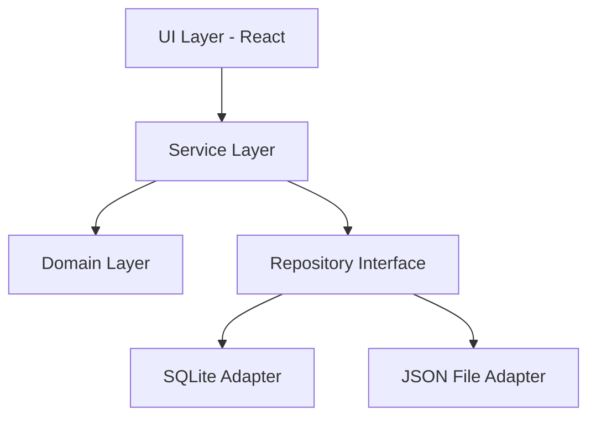

# 📋 Sistema de Tracking de Trabalho - Plano de Desenvolvimento

**Data de Criação:** 30 de Outubro, 2025  
**Versão:** 1.0

---

## 🎯 Visão Geral

### Objetivo
Criar um sistema flexível e dinâmico para rastreamento de trabalho, permitindo planejar, registrar informações importantes e acompanhar o progresso de tickets, substituindo o formulário markdown estático atual.

### Problema a Resolver
- Formulário markdown é estático e não permite personalização
- Difícil de atualizar estrutura sem modificar múltiplos arquivos
- Não há forma fácil de compartilhar ou versionar a estrutura do formulário
- Falta de flexibilidade para diferentes tipos de tickets ou workflows

### Solução Proposta
Sistema web/desktop que permite:
- Criar e gerenciar templates de formulários personalizáveis
- Preencher e acompanhar tickets em tempo real
- Exportar registros preenchidos como markdown
- Importar/exportar estruturas de formulário como JSON
- Manter histórico de trabalho para daily standups e retrospectivas

---

## 📊 Requisitos Funcionais

### RF1 - Gerenciamento de Templates
- [ ] RF1.1: Criar novo template de formulário
- [ ] RF1.2: Editar template existente
- [ ] RF1.3: Deletar template
- [ ] RF1.4: Duplicar template
- [ ] RF1.5: Visualizar lista de templates disponíveis
- [ ] RF1.6: Definir template padrão

### RF2 - Editor de Campos
- [ ] RF2.1: Adicionar campos ao template
- [ ] RF2.2: Remover campos do template
- [ ] RF2.3: Reordenar campos (drag and drop)
- [ ] RF2.4: Editar propriedades dos campos
- [ ] RF2.5: Agrupar campos em seções
- [ ] RF2.6: Definir campos obrigatórios/opcionais

### RF3 - Tipos de Campos Suportados
- [ ] RF3.1: Texto curto (input)
- [ ] RF3.2: Texto longo (textarea)
- [ ] RF3.3: Checkbox (único ou múltiplo)
- [ ] RF3.4: Radio button
- [ ] RF3.5: Select/Dropdown
- [ ] RF3.6: Data/Hora
- [ ] RF3.7: Número
- [ ] RF3.8: Lista de itens (array)
- [ ] RF3.9: Markdown text
- [ ] RF3.10: Tags/Labels

### RF4 - Gerenciamento de Tickets
- [ ] RF4.1: Criar novo ticket a partir de template
- [ ] RF4.2: Editar ticket em progresso
- [ ] RF4.3: Salvar rascunhos automaticamente
- [ ] RF4.4: Marcar ticket como completo
- [ ] RF4.5: Arquivar tickets antigos
- [ ] RF4.6: Buscar/filtrar tickets
- [ ] RF4.7: Visualizar histórico de edições

### RF5 - Import/Export
- [ ] RF5.1: Exportar template como JSON
- [ ] RF5.2: Importar template de JSON
- [ ] RF5.3: Exportar ticket preenchido como Markdown
- [ ] RF5.4: Exportar múltiplos tickets (batch)
- [ ] RF5.5: Validar formato JSON na importação
- [ ] RF5.6: Preview antes de importar/exportar

### RF6 - Daily Standup e Reporting
- [ ] RF6.1: Visualizar tickets em progresso
- [ ] RF6.2: Gerar resumo para daily standup
- [ ] RF6.3: Histórico de trabalho por período
- [ ] RF6.4: Estatísticas de tempo e conclusão
- [ ] RF6.5: Exportar relatórios periódicos

### RF7 - Organização
- [ ] RF7.1: Tags/categorias para tickets
- [ ] RF7.2: Filtros por status, prioridade, data
- [ ] RF7.3: Dashboard com visão geral
- [ ] RF7.4: Busca full-text nos tickets

---

## 🏗️ Requisitos Não-Funcionais

### RNF1 - Performance
- Carregar lista de tickets em < 1s
- Salvar alterações instantaneamente (< 500ms)
- Suporte para 1000+ tickets sem degradação

### RNF2 - Usabilidade
- Interface intuitiva, sem necessidade de tutorial
- Atalhos de teclado para ações comuns
- Responsivo (desktop e mobile)
- Dark mode / Light mode

### RNF3 - Confiabilidade
- Auto-save a cada 30 segundos
- Backup automático dos dados
- Recuperação de dados em caso de falha
- Validação de dados antes de salvar

### RNF4 - Compatibilidade
- Markdown exportado compatível com GitHub/GitLab
- JSON schema versionado para retrocompatibilidade
- Suporte aos principais navegadores

### RNF5 - Manutenibilidade
- Código bem documentado
- Testes automatizados (> 80% cobertura)
- Arquitetura modular e extensível

---

## 🏛️ Arquitetura Proposta

### Tipo de Aplicação
**Opção 1: Web App (SPA)**
- Frontend: React/Vue/Svelte
- Backend: Node.js/Python/Go API
- Database: PostgreSQL/SQLite
- Deploy: Self-hosted ou Cloud

**Opção 2: Desktop App (Recomendado para privacidade)**
- Framework: Electron ou Tauri
- Storage: Local (SQLite ou arquivo JSON)
- Sem necessidade de servidor
- Dados ficam na máquina do usuário

**Opção 3: Híbrida**
- Desktop app com opção de sync cloud opcional
- Melhor dos dois mundos

### Recomendação: **Desktop App com Tauri**
**Por quê?**
- ✅ Dados locais (privacidade)
- ✅ Não precisa de servidor/backend
- ✅ Leve e rápido
- ✅ Cross-platform (Mac, Windows, Linux)
- ✅ Fácil de distribuir

---

## 🛠️ Stack Técnica Recomendada

Seguindo as tecnologias que você já domina nos seus guias:

### Frontend (UI Layer)
```
- Framework: React 18+ com TypeScript ✅ (mesmo dos seus guias)
- UI Library: Shadcn/ui (componentes modernos)
- Styling: Tailwind CSS ✅ (mesmo dos seus guias)
- Forms: React Hook Form + Zod ✅ (validação type-safe)
- Editor: TipTap (para campos markdown)
- Drag & Drop: dnd-kit (reordenar campos)
- Estado: Context API + custom hooks ✅ (padrão dos seus guias)
- Roteamento: React Router 6 ✅
```

### Backend/Storage (Tauri + Rust)
```
- Runtime: Tauri 2.0 (desktop framework)
- Language: Rust (backend commands)
- Database: SQLite (armazenamento local)
- ORM: Diesel ou SeaORM (Rust ORM)
- Serialization: serde (JSON)
- File System: Tauri FS API
- Export: markdown-it (MD), JSON nativo
```

### Domain Layer (TypeScript)
```
- Models: TypeScript interfaces/types
- Validation: Zod schemas
- Business Logic: Pure TypeScript classes
- No Framework Dependencies: Domain independente
```

### Testing
```
- Unit Tests: Vitest ✅ (compatível com Vite)
- Component Tests: Testing Library ✅ (React)
- E2E Tests: Playwright (desktop app)
- Coverage: Vitest Coverage
```

### DevOps e Qualidade
```
- Linting: ESLint + Prettier ✅ (mesmo dos seus guias)
- Type Checking: TypeScript strict mode
- Pre-commit: Husky + lint-staged
- CI/CD: GitHub Actions
- Versionamento: Semantic Versioning
- Releases: Tauri Action (automático)
```

---

## 💾 Modelo de Dados

Seguindo os princípios de **Domain-Driven Design** dos seus guias:

### Domain Layer (TypeScript - Pure Business Logic)

```typescript
// core/domain/ticket.ts
/**
 * Ticket Domain Model
 * Pure business logic - no framework dependencies
 */
export class Ticket {
  constructor(
    public id: string,
    public templateId: string,
    public templateVersion: string,
    public status: TicketStatus,
    public data: Record<string, any>,
    public metadata: TicketMetadata,
    public tags: string[],
    public createdAt: Date,
    public updatedAt: Date,
    public completedAt?: Date
  ) {}

  /**
   * Business validation - no framework knowledge
   */
  validate(): void {
    if (!this.templateId) {
      throw new Error("Template ID is required");
    }
    if (!this.data || Object.keys(this.data).length === 0) {
      throw new Error("Ticket must have data");
    }
  }

  /**
   * Business operations
   */
  markAsCompleted(): void {
    if (this.status === TicketStatus.COMPLETED) {
      throw new Error("Ticket is already completed");
    }
    this.status = TicketStatus.COMPLETED;
    this.completedAt = new Date();
  }

  canBeArchived(): boolean {
    return this.status === TicketStatus.COMPLETED;
  }
}

export enum TicketStatus {
  DRAFT = "draft",
  IN_PROGRESS = "in_progress",
  COMPLETED = "completed",
  ARCHIVED = "archived"
}

export interface TicketMetadata {
  dev: string;
  estimate?: string;
  actualTime?: string;
}

// core/domain/template.ts
/**
 * Template Domain Model
 * Represents the structure of a form
 */
export class Template {
  constructor(
    public id: string,
    public name: string,
    public version: string,
    public isDefault: boolean,
    public sections: Section[],
    public createdAt: Date,
    public updatedAt: Date
  ) {}

  validate(): void {
    if (!this.name || this.name.length < 3) {
      throw new Error("Template name must have at least 3 characters");
    }
    if (!this.sections || this.sections.length === 0) {
      throw new Error("Template must have at least one section");
    }
  }

  addSection(section: Section): void {
    this.sections.push(section);
  }

  removeSection(sectionId: string): void {
    this.sections = this.sections.filter(s => s.id !== sectionId);
  }
}

export interface Section {
  id: string;
  title: string;
  order: number;
  fields: Field[];
}

export interface Field {
  id: string;
  label: string;
  type: FieldType;
  required: boolean;
  placeholder?: string;
  order: number;
  validation?: FieldValidation;
  options?: string[];
}

export enum FieldType {
  TEXT = "text",
  TEXTAREA = "textarea",
  CHECKBOX = "checkbox",
  RADIO = "radio",
  SELECT = "select",
  DATE = "date",
  NUMBER = "number",
  MARKDOWN = "markdown"
}

export interface FieldValidation {
  minLength?: number;
  maxLength?: number;
  min?: number;
  max?: number;
  pattern?: string;
}
```

### Database Models (SQLite - Infrastructure Layer)

```sql
-- infra/database/schema.sql

-- Templates table
CREATE TABLE templates (
  id TEXT PRIMARY KEY,
  name TEXT NOT NULL,
  version TEXT NOT NULL,
  is_default INTEGER NOT NULL DEFAULT 0,
  created_at TEXT NOT NULL,
  updated_at TEXT NOT NULL,
  -- Sections stored as JSON
  sections_json TEXT NOT NULL
);

-- Tickets table
CREATE TABLE tickets (
  id TEXT PRIMARY KEY,
  template_id TEXT NOT NULL,
  template_version TEXT NOT NULL,
  status TEXT NOT NULL,
  -- Ticket data stored as JSON (flexible schema)
  data_json TEXT NOT NULL,
  -- Metadata stored as JSON
  metadata_json TEXT NOT NULL,
  -- Tags stored as JSON array
  tags_json TEXT NOT NULL,
  created_at TEXT NOT NULL,
  updated_at TEXT NOT NULL,
  completed_at TEXT,
  FOREIGN KEY (template_id) REFERENCES templates(id)
);

-- Indexes for performance
CREATE INDEX idx_tickets_template_id ON tickets(template_id);
CREATE INDEX idx_tickets_status ON tickets(status);
CREATE INDEX idx_tickets_created_at ON tickets(created_at);

-- Full-text search on ticket data (for search functionality)
CREATE VIRTUAL TABLE tickets_fts USING fts5(
  id,
  data_text,
  content='tickets',
  content_rowid='rowid'
);
```

### Repository Interfaces (Ports - Secondary)

```typescript
// core/interfaces/secondary/ITicketRepository.ts
/**
 * Ticket Repository Interface
 * Defines data persistence contract (Dependency Inversion Principle)
 */
export interface ITicketRepository {
  findAll(filter?: TicketFilter): Promise<Ticket[]>;
  findById(id: string): Promise<Ticket | null>;
  findByStatus(status: TicketStatus): Promise<Ticket[]>;
  save(ticket: Ticket): Promise<Ticket>;
  delete(id: string): Promise<boolean>;
  count(filter?: TicketFilter): Promise<number>;
}

// core/interfaces/secondary/ITemplateRepository.ts
export interface ITemplateRepository {
  findAll(): Promise<Template[]>;
  findById(id: string): Promise<Template | null>;
  findDefault(): Promise<Template | null>;
  save(template: Template): Promise<Template>;
  delete(id: string): Promise<boolean>;
}
```

### Service Interfaces (Ports - Primary)

```typescript
// core/interfaces/primary/ITicketService.ts
/**
 * Ticket Service Interface
 * Defines business operations contract
 */
export interface ITicketService {
  listTickets(filter?: TicketFilter): Promise<Ticket[]>;
  getTicket(id: string): Promise<Ticket | null>;
  createTicket(ticket: Ticket): Promise<Ticket>;
  updateTicket(id: string, ticket: Ticket): Promise<Ticket>;
  deleteTicket(id: string): Promise<boolean>;
  markAsCompleted(id: string): Promise<Ticket>;
  exportToMarkdown(id: string): Promise<string>;
}

// core/interfaces/primary/ITemplateService.ts
export interface ITemplateService {
  listTemplates(): Promise<Template[]>;
  getTemplate(id: string): Promise<Template | null>;
  createTemplate(template: Template): Promise<Template>;
  updateTemplate(id: string, template: Template): Promise<Template>;
  deleteTemplate(id: string): Promise<boolean>;
  importFromJSON(json: string): Promise<Template>;
  exportToJSON(id: string): Promise<string>;
}
```

### Filter Pattern (BaseFilter + Specific Filters)

```typescript
// core/services/filters/BaseFilter.ts
/**
 * Base Filter - Common filtering, pagination, and sorting
 * All entity filters extend this
 */
export class BaseFilter {
  constructor(
    public search?: string,
    public page?: number,
    public pageSize?: number,
    public sortBy?: string,
    public sortOrder?: 'asc' | 'desc'
  ) {}

  getOffset(): number {
    return ((this.page || 1) - 1) * (this.pageSize || 20);
  }

  getLimit(): number {
    return this.pageSize || 20;
  }
}

// core/services/filters/TicketFilter.ts
/**
 * Ticket Filter - Ticket-specific filters
 */
export class TicketFilter extends BaseFilter {
  constructor(
    public status?: TicketStatus,
    public templateId?: string,
    public tags?: string[],
    public dateFrom?: Date,
    public dateTo?: Date,
    // BaseFilter properties
    search?: string,
    page?: number,
    pageSize?: number,
    sortBy?: string,
    sortOrder?: 'asc' | 'desc'
  ) {
    super(search, page, pageSize, sortBy, sortOrder);
  }
}
```

### Repository Implementations (Adapters - Infrastructure)

```typescript
// infra/database/repositories/SQLiteTicketRepository.ts
/**
 * SQLite Ticket Repository
 * Adapter that implements ITicketRepository using SQLite
 */
export class SQLiteTicketRepository implements ITicketRepository {
  constructor(private db: Database) {}

  async findAll(filter?: TicketFilter): Promise<Ticket[]> {
    let query = 'SELECT * FROM tickets WHERE 1=1';
    const params: any[] = [];

    if (filter) {
      // Apply filters
      if (filter.search) {
        query += ' AND data_json LIKE ?';
        params.push(`%${filter.search}%`);
      }
      if (filter.status) {
        query += ' AND status = ?';
        params.push(filter.status);
      }
      if (filter.templateId) {
        query += ' AND template_id = ?';
        params.push(filter.templateId);
      }

      // Apply sorting
      if (filter.sortBy) {
        query += ` ORDER BY ${filter.sortBy} ${filter.sortOrder || 'ASC'}`;
      }

      // Apply pagination
      if (filter.pageSize) {
        query += ' LIMIT ? OFFSET ?';
        params.push(filter.getLimit(), filter.getOffset());
      }
    }

    const rows = await this.db.query(query, params);
    return rows.map(row => TicketMapper.toDomain(row));
  }

  async count(filter?: TicketFilter): Promise<number> {
    let query = 'SELECT COUNT(*) as total FROM tickets WHERE 1=1';
    const params: any[] = [];

    if (filter) {
      // Same filters as findAll, but no pagination/sorting
      if (filter.search) {
        query += ' AND data_json LIKE ?';
        params.push(`%${filter.search}%`);
      }
      if (filter.status) {
        query += ' AND status = ?';
        params.push(filter.status);
      }
    }

    const result = await this.db.queryOne(query, params);
    return result.total;
  }

  // ... other methods
}
```

### Mappers (Domain ↔ Database)

```typescript
// infra/database/mappers/TicketMapper.ts
/**
 * Ticket Mapper
 * Converts between database models and domain models
 */
export class TicketMapper {
  static toDomain(row: TicketRow): Ticket {
    return new Ticket(
      row.id,
      row.template_id,
      row.template_version,
      row.status as TicketStatus,
      JSON.parse(row.data_json),
      JSON.parse(row.metadata_json),
      JSON.parse(row.tags_json),
      new Date(row.created_at),
      new Date(row.updated_at),
      row.completed_at ? new Date(row.completed_at) : undefined
    );
  }

  static fromDomain(ticket: Ticket): TicketRow {
    return {
      id: ticket.id,
      template_id: ticket.templateId,
      template_version: ticket.templateVersion,
      status: ticket.status,
      data_json: JSON.stringify(ticket.data),
      metadata_json: JSON.stringify(ticket.metadata),
      tags_json: JSON.stringify(ticket.tags),
      created_at: ticket.createdAt.toISOString(),
      updated_at: ticket.updatedAt.toISOString(),
      completed_at: ticket.completedAt?.toISOString()
    };
  }
}
```

---

## 📁 Estrutura de Pastas (Hexagonal Architecture)

```
src/
├── core/                           # DOMAIN + BUSINESS LOGIC
│   ├── domain/                     # Pure domain models
│   │   ├── ticket.ts              # Ticket entity
│   │   ├── template.ts            # Template entity
│   │   ├── field.ts               # Field value object
│   │   └── types.ts               # Shared types
│   ├── interfaces/                # Ports (abstractions)
│   │   ├── primary/               # Driving ports (Services)
│   │   │   ├── ITicketService.ts
│   │   │   ├── ITemplateService.ts
│   │   │   └── IExportService.ts
│   │   └── secondary/             # Driven ports (Repositories)
│   │       ├── ITicketRepository.ts
│   │       ├── ITemplateRepository.ts
│   │       └── IStorageService.ts
│   ├── services/                  # Business logic implementation
│   │   ├── TicketService.ts       # Ticket operations
│   │   ├── TemplateService.ts     # Template operations
│   │   ├── ReportService.ts       # Reports and analytics
│   │   ├── ExportService.ts       # MD/JSON export
│   │   └── filters/               # Filter pattern
│   │       ├── BaseFilter.ts
│   │       └── TicketFilter.ts
│   └── exceptions/                # Domain exceptions
│       └── DomainExceptions.ts
│
├── infra/                         # INFRASTRUCTURE (Adapters)
│   ├── database/                  # Database adapter
│   │   ├── sqlite.ts             # SQLite connection
│   │   ├── schema.sql            # Database schema
│   │   ├── repositories/         # Repository implementations
│   │   │   ├── SQLiteTicketRepository.ts
│   │   │   ├── SQLiteTemplateRepository.ts
│   │   │   └── JSONFileRepository.ts    # Backup adapter
│   │   └── mappers/              # DB ↔ Domain mappers
│   │       ├── TicketMapper.ts
│   │       └── TemplateMapper.ts
│   ├── storage/                   # File system adapter
│   │   └── TauriStorageService.ts
│   └── export/                    # Export adapters
│       ├── MarkdownExporter.ts
│       └── JSONExporter.ts
│
├── app/                           # APPLICATION (UI + API)
│   ├── components/                # React components
│   │   ├── ui/                   # Base UI components
│   │   │   ├── Button.tsx
│   │   │   ├── Input.tsx
│   │   │   ├── Select.tsx
│   │   │   └── Card.tsx
│   │   ├── layouts/              # Layout components
│   │   │   ├── MainLayout.tsx
│   │   │   └── EditorLayout.tsx
│   │   ├── ticket/               # Ticket feature
│   │   │   ├── TicketList.tsx
│   │   │   ├── TicketEditor.tsx
│   │   │   ├── TicketCard.tsx
│   │   │   └── TicketFilters.tsx
│   │   ├── template/             # Template feature
│   │   │   ├── TemplateBuilder.tsx
│   │   │   ├── FieldEditor.tsx
│   │   │   └── SectionEditor.tsx
│   │   └── dashboard/            # Dashboard
│   │       ├── DailySt andup.tsx
│   │       └── Statistics.tsx
│   ├── pages/                     # Page components
│   │   ├── Dashboard.tsx
│   │   ├── TicketsPage.tsx
│   │   ├── TicketEditPage.tsx
│   │   ├── TemplatesPage.tsx
│   │   └── SettingsPage.tsx
│   ├── hooks/                     # Custom React hooks
│   │   ├── useTickets.ts
│   │   ├── useTemplates.ts
│   │   ├── useAutoSave.ts
│   │   └── useExport.ts
│   ├── store/                     # State management (Context)
│   │   ├── TicketContext.tsx
│   │   ├── TemplateContext.tsx
│   │   └── AppContext.tsx
│   └── mappers/                   # Domain ↔ DTO mappers
│       ├── TicketMapper.ts       # API mappers
│       └── TemplateMapper.ts
│
├── lib/                           # Third-party setup
│   ├── tauri.ts                  # Tauri API setup
│   └── database.ts               # Database connection
│
├── utils/                         # Pure utility functions
│   ├── formatters.ts
│   ├── validators.ts
│   └── dateHelpers.ts
│
└── tests/                         # Tests (mirroring src structure)
    ├── unit/
    │   ├── domain/
    │   ├── services/
    │   └── mappers/
    └── integration/
        ├── repositories/
        └── e2e/
```

---

## 🎨 Features Principais

### 1. Template Builder (Editor Visual)
**Interface:**
```
┌─────────────────────────────────────────────┐
│ Template: Problem Solving Roadmap      [⚙️] │
├─────────────────────────────────────────────┤
│                                             │
│  📋 Sections                  [+ Add]       │
│  ├─ 1. What needs to be done?    [↑][↓][×] │
│  │   └─ Fields: 5                [Edit]    │
│  ├─ 2. How will I know I'm done? [↑][↓][×] │
│  │   └─ Fields: 3                [Edit]    │
│  └─ 3. Am I prepared?            [↑][↓][×] │
│      └─ Fields: 8                [Edit]    │
│                                             │
│  [Preview] [Export JSON] [Save]             │
└─────────────────────────────────────────────┘
```

### 2. Ticket Workspace
**Interface:**
```
┌─────────────────────────────────────────────┐
│ 📊 Dashboard                    [@felipe]  │
├─────────────────────────────────────────────┤
│ Filters: [All] [In Progress] [Done] [🔍]   │
├─────────────────────────────────────────────┤
│                                             │
│  🟡 TICKET-123: Implement auth              │
│     Started: 2 hours ago | Est: 3h          │
│     [Open] [Export MD]                      │
│                                             │
│  🟢 TICKET-122: Fix login bug               │
│     Completed yesterday                     │
│     [View] [Export MD]                      │
│                                             │
│  [+ New Ticket]                             │
└─────────────────────────────────────────────┘
```

### 3. Ticket Editor
**Interface:**
```
┌─────────────────────────────────────────────┐
│ Edit: TICKET-123                 [Auto-save]│
├─────────────────────────────────────────────┤
│ Template: Problem Solving Roadmap ▼         │
├─────────────────────────────────────────────┤
│                                             │
│ 1️⃣ WHAT NEEDS TO BE DONE?                  │
│                                             │
│ Title: [Implement user authentication     ] │
│                                             │
│ Type: ☑️ Feature  ☐ Bug  ☐ Investigation   │
│                                             │
│ Priority: ⚫ P0  🔴 P1  ⚪ P2  ⚪ P3         │
│                                             │
│ ────────────────────────────────────────    │
│                                             │
│ [Save Draft] [Mark Complete] [Export MD]    │
└─────────────────────────────────────────────┘
```

### 4. Daily Standup View
**Interface:**
```
┌─────────────────────────────────────────────┐
│ 📅 Daily Standup - Oct 30, 2025             │
├─────────────────────────────────────────────┤
│                                             │
│ Yesterday (Oct 29):                         │
│  ✅ TICKET-122: Fixed login bug             │
│  ✅ TICKET-121: Updated documentation       │
│                                             │
│ Today (In Progress):                        │
│  🟡 TICKET-123: Implement auth (50% done)   │
│                                             │
│ Blockers:                                   │
│  ⚠️ Waiting for API keys from DevOps       │
│                                             │
│ [Copy to Clipboard] [Export MD]             │
└─────────────────────────────────────────────┘
```

---

## 🏛️ Princípios Arquiteturais (SOLID)

Aplicando os **SOLID Principles** que você segue nos seus guias:

### ✅ Single Responsibility Principle (SRP)
**"Cada classe tem uma única razão para mudar"**

```typescript
// ✅ GOOD: Cada classe faz UMA coisa
class Ticket {
  // Apenas lógica de negócio do ticket
  validate(): void { }
  markAsCompleted(): void { }
}

class TicketRepository {
  // Apenas persistência de dados
  save(ticket: Ticket): Promise<Ticket> { }
}

class TicketService {
  // Apenas orquestração de negócio
  createTicket(ticket: Ticket): Promise<Ticket> { }
}

class MarkdownExporter {
  // Apenas exportação de markdown
  export(ticket: Ticket): string { }
}
```

### ✅ Open/Closed Principle (OCP)
**"Aberto para extensão, fechado para modificação"**

```typescript
// Interface nunca precisa mudar
interface ITicketRepository {
  save(ticket: Ticket): Promise<Ticket>;
}

// Podemos ADICIONAR novos adaptadores sem MODIFICAR código existente
class SQLiteTicketRepository implements ITicketRepository { }
class JSONFileRepository implements ITicketRepository { }      // Novo!
class CloudSyncRepository implements ITicketRepository { }     // Novo no futuro!
```

### ✅ Liskov Substitution Principle (LSP)
**"Subtipos devem ser substituíveis por seus tipos base"**

```typescript
// Todos os repositórios são intercambiáveis
let repository: ITicketRepository;

repository = new SQLiteTicketRepository();  // Funciona
const ticket1 = await repository.save(ticket);

repository = new JSONFileRepository();      // Troca sem quebrar
const ticket2 = await repository.save(ticket);  // Mesma interface!
```

### ✅ Interface Segregation Principle (ISP)
**"Interfaces focadas, não interfaces gordas"**

```typescript
// ❌ BAD: Interface gorda
interface ITicketService {
  create(), update(), delete(), export(), import(), 
  generateReport(), sendEmail(), syncCloud() // Muitas responsabilidades!
}

// ✅ GOOD: Interfaces focadas
interface ITicketService {
  createTicket(), updateTicket(), deleteTicket()  // Apenas CRUD
}

interface IExportService {
  exportToMarkdown(), exportToJSON()  // Apenas export
}

interface IReportService {
  generateDailyStandup(), generateStatistics()  // Apenas reports
}
```

### ✅ Dependency Inversion Principle (DIP)
**"Dependa de abstrações, não de implementações concretas"**

```typescript
// ✅ GOOD: Serviço depende de INTERFACE, não de implementação
class TicketService implements ITicketService {
  constructor(
    private repository: ITicketRepository,  // Interface!
    private exporter: IExportService        // Interface!
  ) {}

  async createTicket(ticket: Ticket): Promise<Ticket> {
    ticket.validate();
    return await this.repository.save(ticket);  // Não sabe se é SQLite ou JSON
  }
}

// Dependency Injection (Factory Pattern)
function createTicketService(): TicketService {
  const repository = new SQLiteTicketRepository(db);
  const exporter = new MarkdownExporter();
  return new TicketService(repository, exporter);
}
```

---

## 🔄 Benefícios da Arquitetura Hexagonal para este Projeto

### 1. **Fácil Trocar Storage**
```typescript
// Hoje: SQLite local
const repository = new SQLiteTicketRepository();

// Amanhã: Adicionar cloud sync (sem mudar domínio!)
const repository = new CloudSyncRepository();

// Testes: In-memory (rápido!)
const repository = new InMemoryRepository();
```

### 2. **Testabilidade Total**
```typescript
// Teste de unidade: mock repository
const mockRepository = createMockRepository();
const service = new TicketService(mockRepository);
await service.createTicket(ticket);  // Testa lógica sem DB real

// Teste de integração: repository real
const realRepository = new SQLiteTicketRepository(db);
const service = new TicketService(realRepository);
```

### 3. **Independência de Framework**
```typescript
// Domain não conhece React, Tauri, ou SQLite
class Ticket {
  validate(): void {
    // Apenas TypeScript puro!
  }
}

// Pode ser reutilizado em:
// - Desktop app (Tauri)
// - Web app (Vite)
// - Mobile app (React Native)
// - CLI (Node.js)
```

### 4. **Evolução Sem Quebrar**
```
Fase 1: SQLite local
  ↓ (adicionar adapter, não modificar existente)
Fase 2: + Export para JSON files
  ↓ (adicionar adapter, não modificar existente)
Fase 3: + Cloud sync opcional
  ↓ (adicionar adapter, não modificar existente)
Fase 4: + Import de Jira/GitHub Issues
```

---

## 🚀 Fluxo de Uso

### Fluxo 1: Primeiro Uso
1. Usuário abre o app
2. Sistema mostra wizard de onboarding
3. Usuário pode importar template existente (JSON) ou usar padrão
4. Sistema cria primeiro ticket de exemplo
5. Usuário explora a interface

### Fluxo 2: Criar Template Customizado
1. Usuário vai em Settings → Templates
2. Clica em "New Template" ou "Edit" template existente
3. Adiciona/remove/reordena seções e campos
4. Visualiza preview do formulário
5. Salva template
6. (Opcional) Exporta template como JSON para backup/share

### Fluxo 3: Trabalhar em um Ticket
1. Usuário clica em "New Ticket"
2. Seleciona template desejado
3. Preenche campos do formulário
4. Sistema auto-salva a cada 30s
5. Usuário atualiza progresso durante o dia
6. Marca steps como completos
7. Ao final, marca ticket como "Done"
8. (Opcional) Exporta ticket como Markdown para documentação

### Fluxo 4: Preparar Daily Standup
1. Usuário vai em "Daily Standup" view
2. Sistema automaticamente mostra:
   - Tickets completos ontem
   - Tickets em progresso hoje
   - Blockers identificados
3. Usuário copia texto gerado ou exporta MD
4. Usa na reunião diária

### Fluxo 5: Retrospectiva
1. Usuário filtra tickets por período (última sprint)
2. Visualiza estatísticas:
   - Tempo estimado vs real
   - Tipos de tickets mais comuns
   - Principais aprendizados registrados
3. Exporta relatório para discussão

---

## 📅 Fases de Implementação

### 🎯 Fase 1: MVP Core + Arquitetura (2-3 semanas)
**Objetivo:** Fundação arquitetural sólida + Sistema básico funcional

**Semana 1: Setup + Domain Layer**
- [ ] **Setup Projeto**
  - [ ] Criar projeto Tauri 2.0 + Vite + React + TypeScript
  - [ ] Configurar ESLint + Prettier (padrão dos seus guias)
  - [ ] Configurar Tailwind CSS
  - [ ] Setup Vitest para testes
  - [ ] Estrutura de pastas hexagonal (core/, infra/, app/)

- [ ] **Domain Layer (Pure Business Logic)**
  - [ ] `core/domain/Ticket.ts` - Modelo de domínio puro
  - [ ] `core/domain/Template.ts` - Modelo de domínio puro
  - [ ] `core/domain/types.ts` - Enums e types
  - [ ] Validações de negócio (sem dependências externas)
  - [ ] Testes unitários de domínio (100% coverage)

**Semana 2: Service Layer + Repository Interfaces**
- [ ] **Repository Interfaces (Secondary Ports)**
  - [ ] `core/interfaces/secondary/ITicketRepository.ts`
  - [ ] `core/interfaces/secondary/ITemplateRepository.ts`
  - [ ] Documentar contrato das interfaces

- [ ] **Service Interfaces (Primary Ports)**
  - [ ] `core/interfaces/primary/ITicketService.ts`
  - [ ] `core/interfaces/primary/ITemplateService.ts`
  - [ ] `core/interfaces/primary/IExportService.ts`

- [ ] **Service Implementation**
  - [ ] `core/services/TicketService.ts` - Lógica de negócio
  - [ ] `core/services/TemplateService.ts` - Lógica de negócio
  - [ ] `core/services/ExportService.ts` - Export MD/JSON
  - [ ] Testes unitários com mocks (80%+ coverage)

**Semana 3: Infrastructure + UI Básica**
- [ ] **SQLite Adapter (Infrastructure)**
  - [ ] Schema SQL (schema.sql)
  - [ ] `infra/database/repositories/SQLiteTicketRepository.ts`
  - [ ] `infra/database/repositories/SQLiteTemplateRepository.ts`
  - [ ] `infra/database/mappers/TicketMapper.ts` (DB ↔ Domain)
  - [ ] `infra/database/mappers/TemplateMapper.ts` (DB ↔ Domain)
  - [ ] Testes de integração com SQLite real

- [ ] **UI Básica (React + Shadcn/ui)**
  - [ ] Lista de tickets (com filtros básicos)
  - [ ] Formulário de ticket (campos: text, textarea, checkbox, select)
  - [ ] Export ticket para Markdown (botão + preview)
  - [ ] Context API para estado global

- [ ] **Filter Pattern**
  - [ ] `core/services/filters/BaseFilter.ts`
  - [ ] `core/services/filters/TicketFilter.ts`
  - [ ] Aplicar filtros no repository (SQL level)

**Entrega Fase 1:**
✅ Arquitetura hexagonal implementada
✅ Domain layer puro e testado
✅ SQLite funcionando com mappers
✅ CRUD de tickets funcional
✅ Export para Markdown
✅ Testes unitários + integração (70%+ coverage)

---

### 🎯 Fase 2: Template Builder (2 semanas)
**Objetivo:** UI visual para criar/editar templates

**Semana 1: Template CRUD + Validações**
- [ ] **Template Service**
  - [ ] CRUD completo de templates
  - [ ] Validação de template (Zod schemas)
  - [ ] Versionamento de templates
  - [ ] Template padrão (flag default)

- [ ] **Template UI Components**
  - [ ] `TemplateList.tsx` - Lista de templates
  - [ ] `TemplateEditor.tsx` - Editor base
  - [ ] `SectionEditor.tsx` - Editar seções
  - [ ] `FieldEditor.tsx` - Editar campos
  - [ ] Validação em tempo real (React Hook Form + Zod)

**Semana 2: Drag & Drop + Import/Export**
- [ ] **Drag & Drop (dnd-kit)**
  - [ ] Reordenar seções (drag vertical)
  - [ ] Reordenar campos dentro de seção
  - [ ] Mover campos entre seções

- [ ] **Import/Export JSON**
  - [ ] `JSONExporter.ts` - Export template para JSON
  - [ ] `JSONImporter.ts` - Import template de JSON
  - [ ] UI para upload/download JSON
  - [ ] Validação de JSON schema antes de importar
  - [ ] Preview do template antes de importar

- [ ] **Template Marketplace**
  - [ ] 3-5 templates prontos (Problem Solving, Bug Report, Feature Request)
  - [ ] UI para selecionar template pronto
  - [ ] Duplicar template existente

**Entrega Fase 2:**
✅ Template builder visual completo
✅ Drag & drop funcionando
✅ Import/Export JSON com validação
✅ Templates prontos disponíveis

---

### 🎯 Fase 3: UX e Produtividade (2 semanas)
**Objetivo:** Melhorar experiência de uso

**Semana 1: Auto-save + Atalhos + Search**
- [ ] **Auto-save (Pattern: Debounce)**
  - [ ] `useAutoSave.ts` hook customizado
  - [ ] Debounce de 2 segundos (evitar saves excessivos)
  - [ ] Indicador visual de "salvando..." / "salvo"
  - [ ] Recuperação de rascunho (se app crashar)

- [ ] **Atalhos de Teclado**
  - [ ] Cmd/Ctrl + S: Salvar manual
  - [ ] Cmd/Ctrl + N: Novo ticket
  - [ ] Cmd/Ctrl + F: Buscar
  - [ ] Cmd/Ctrl + E: Exportar
  - [ ] ESC: Fechar modal
  - [ ] ?: Mostrar atalhos disponíveis

- [ ] **Search/Filter Avançado**
  - [ ] Full-text search (SQLite FTS5)
  - [ ] Filtro por status (draft, in_progress, completed)
  - [ ] Filtro por template
  - [ ] Filtro por data (range picker)
  - [ ] Filtro por tags (multi-select)
  - [ ] Combinação de filtros (AND logic)
  - [ ] Salvar filtros favoritos

**Semana 2: Dashboard + Dark Mode + History**
- [ ] **Dashboard com Estatísticas**
  - [ ] Tickets em progresso (hoje)
  - [ ] Tickets completados (última semana)
  - [ ] Tempo médio por ticket
  - [ ] Gráfico de produtividade (Chart.js ou Recharts)
  - [ ] Tags mais usadas

- [ ] **Dark Mode**
  - [ ] Theme toggle (light/dark/system)
  - [ ] Persistir preferência (localStorage)
  - [ ] Tailwind dark: variants
  - [ ] Smooth transition

- [ ] **History e Tags**
  - [ ] Sistema de tags (criar, editar, deletar)
  - [ ] Auto-complete de tags
  - [ ] Tag colors customizáveis
  - [ ] History de edições (últimas 5 mudanças)
  - [ ] Undo/Redo básico (para editor de ticket)

**Entrega Fase 3:**
✅ Auto-save robusto com debounce
✅ Atalhos de teclado produtivos
✅ Search full-text rápido
✅ Dashboard com estatísticas
✅ Dark mode completo

---

### 🎯 Fase 4: Daily Standup e Reporting (1-2 semanas)
**Objetivo:** Features para comunicação e retrospectiva

**Semana 1: Daily Standup + Time Tracking**
- [ ] **Daily Standup View (ReportService)**
  - [ ] `core/services/ReportService.ts` - Lógica de reports
  - [ ] Query tickets: completed yesterday, in_progress today
  - [ ] Extrair blockers de tickets
  - [ ] Formatar para texto/markdown
  - [ ] Copy to clipboard (um clique)
  - [ ] Template customizável de daily

- [ ] **Time Tracking**
  - [ ] Campo "estimate" vs "actualTime" no metadata
  - [ ] Cálculo automático de tempo gasto
  - [ ] Parser de tempo ("2h 30min" → minutos)
  - [ ] Comparação estimate vs real
  - [ ] Alertas de over-time

**Semana 2: Relatórios + Export Batch**
- [ ] **Relatórios Automáticos**
  - [ ] Relatório semanal (tickets completados)
  - [ ] Relatório mensal (estatísticas)
  - [ ] Retrospectiva de sprint
  - [ ] Principais aprendizados (agregados)

- [ ] **Gráficos e Visualizações**
  - [ ] Gráfico de produtividade (tickets/dia)
  - [ ] Distribuição por tipo (Feature, Bug, etc.)
  - [ ] Tempo médio por prioridade
  - [ ] Trend de estimate accuracy

- [ ] **Export Múltiplos Tickets**
  - [ ] Selecionar múltiplos tickets
  - [ ] Export batch para MD (um arquivo por ticket)
  - [ ] Export batch para ZIP
  - [ ] Export filtered list (todos os resultados da busca)

**Entrega Fase 4:**
✅ Daily standup automático
✅ Time tracking funcional
✅ Relatórios customizáveis
✅ Gráficos de produtividade
✅ Export em batch

---

### 🎯 Fase 5: Features Avançadas (Futuro)
**Features opcionais para considerar (novos adapters!):**
- [ ] **Cloud Sync Adapter** (opcional)
  - [ ] `infra/cloud/CloudSyncRepository.ts`
  - [ ] Sync com Google Drive / Dropbox / iCloud
  - [ ] Conflict resolution (last-write-wins ou merge)
  - [ ] Adapter Pattern: mesmo ITicketRepository!

- [ ] **Jira/GitHub Adapter**
  - [ ] `infra/integrations/JiraAdapter.ts`
  - [ ] Import issues do Jira como tickets
  - [ ] Implementa ITicketRepository
  - [ ] Mapper: JiraIssue → Ticket domain

- [ ] **AI Integration**
  - [ ] Sugerir breakdown de tasks (OpenAI API)
  - [ ] Estimar tempo baseado em histórico
  - [ ] Sugerir tags baseado em descrição
  - [ ] Pattern: AI como Secondary Adapter

- [ ] **Outros**
  - [ ] Mobile app (React Native, mesmo domain layer!)
  - [ ] Plugin VSCode (compartilha core layer)
  - [ ] CLI tool (Node.js, compartilha core layer)
  - [ ] API REST (se quiser multi-user no futuro)

---

## 🎨 Design Patterns Utilizados

Baseado nos padrões dos seus guias de arquitetura:

### 1. **Repository Pattern** ⭐⭐⭐
**Onde:** `core/interfaces/secondary/`, `infra/database/repositories/`
**Por quê:** Abstração de persistência, fácil trocar DB

```typescript
interface ITicketRepository {
  findAll(): Promise<Ticket[]>;
}

class SQLiteTicketRepository implements ITicketRepository { }
class JSONFileRepository implements ITicketRepository { }
```

### 2. **Service Layer Pattern** ⭐⭐⭐
**Onde:** `core/services/`
**Por quê:** Orquestração de lógica de negócio

```typescript
class TicketService {
  constructor(private repository: ITicketRepository) {}
  
  async createTicket(ticket: Ticket): Promise<Ticket> {
    ticket.validate();  // Business logic
    return await this.repository.save(ticket);
  }
}
```

### 3. **Mapper Pattern** ⭐⭐
**Onde:** `infra/database/mappers/`, `app/mappers/`
**Por quê:** Separação entre camadas (DB ↔ Domain, Domain ↔ DTO)

```typescript
class TicketMapper {
  static toDomain(row: TicketRow): Ticket { }
  static fromDomain(ticket: Ticket): TicketRow { }
}
```

### 4. **Factory Pattern** ⭐⭐
**Onde:** Service factories, Component factories
**Por quê:** Dependency Injection simples

```typescript
function createTicketService(): ITicketService {
  const db = getDatabase();
  const repository = new SQLiteTicketRepository(db);
  return new TicketService(repository);
}
```

### 5. **Filter Pattern** ⭐
**Onde:** `core/services/filters/`
**Por quê:** DRY para filtros, paginação, ordenação

```typescript
class BaseFilter {
  search?: string;
  page?: number;
  sortBy?: string;
}

class TicketFilter extends BaseFilter {
  status?: TicketStatus;
  tags?: string[];
}
```

### 6. **Strategy Pattern** ⭐
**Onde:** Export strategies (MD, JSON, PDF)
**Por quê:** Diferentes algoritmos de export

```typescript
interface IExportStrategy {
  export(ticket: Ticket): string;
}

class MarkdownExportStrategy implements IExportStrategy { }
class JSONExportStrategy implements IExportStrategy { }
class PDFExportStrategy implements IExportStrategy { }
```

### 7. **Observer Pattern**
**Onde:** Auto-save, real-time updates
**Por quê:** Notificar mudanças

```typescript
class TicketObserver {
  onChange(callback: (ticket: Ticket) => void) { }
  notify(ticket: Ticket) { }
}
```

### 8. **Singleton Pattern**
**Onde:** Database connection, Settings
**Por quê:** Uma única instância

```typescript
class Database {
  private static instance: Database;
  static getInstance(): Database { }
}
```

---

## 🧪 Estratégia de Testes

Seguindo os padrões de teste dos seus guias:

### Pirâmide de Testes
```
        /\
       /E2E\         ← 5% - User journeys (Playwright)
      /------\
     / Integ  \      ← 25% - Repository + DB real
    /----------\
   / Unit Tests \    ← 70% - Domain + Services (mocks)
  /--------------\
```

### Testes Unitários (70% dos testes)
**Onde:** `tests/unit/`
**O quê testar:**
- ✅ Domain models (validações, business logic)
- ✅ Services (com repositórios mockados)
- ✅ Mappers (conversões)
- ✅ Utilities (formatters, validators)
- ✅ Custom hooks (React)

```typescript
// tests/unit/domain/Ticket.test.ts
describe('Ticket Domain Model', () => {
  it('should validate required fields', () => {
    const ticket = new Ticket(/* ... */);
    expect(() => ticket.validate()).not.toThrow();
  });

  it('should throw on invalid data', () => {
    const ticket = new Ticket(/* invalid */);
    expect(() => ticket.validate()).toThrow('Template ID is required');
  });
});

// tests/unit/services/TicketService.test.ts
describe('TicketService', () => {
  it('should create ticket', async () => {
    const mockRepository = createMockRepository();
    const service = new TicketService(mockRepository);
    
    await service.createTicket(ticket);
    
    expect(mockRepository.save).toHaveBeenCalledWith(ticket);
  });
});
```

### Testes de Integração (25% dos testes)
**Onde:** `tests/integration/`
**O quê testar:**
- ✅ Repositories com SQLite real
- ✅ Mappers com DB real
- ✅ Export/Import de arquivos
- ✅ Tauri commands

```typescript
// tests/integration/repositories/SQLiteTicketRepository.test.ts
describe('SQLiteTicketRepository Integration', () => {
  it('should save and retrieve ticket from real DB', async () => {
    const db = await createTestDatabase();
    const repository = new SQLiteTicketRepository(db);
    
    const saved = await repository.save(ticket);
    const found = await repository.findById(saved.id);
    
    expect(found).toEqual(saved);
  });
});
```

### Testes E2E (5% dos testes)
**Onde:** `tests/e2e/`
**O quê testar:**
- ✅ Fluxos completos de usuário
- ✅ Happy paths principais

```typescript
// tests/e2e/ticket-workflow.test.ts
import { test, expect } from '@playwright/test';

test('complete ticket workflow', async ({ page }) => {
  // 1. Criar ticket
  await page.click('[data-testid="new-ticket"]');
  await page.fill('[name="title"]', 'My Ticket');
  await page.click('[data-testid="save"]');
  
  // 2. Editar ticket
  await page.click('[data-testid="edit"]');
  await page.fill('[name="description"]', 'Updated');
  
  // 3. Marcar como completo
  await page.click('[data-testid="mark-complete"]');
  
  // 4. Exportar para MD
  await page.click('[data-testid="export-md"]');
  
  // Verificar arquivo exportado
  const download = await page.waitForEvent('download');
  expect(download.suggestedFilename()).toMatch(/\.md$/);
});
```

### Cobertura de Testes
**Objetivos:**
- Domain Layer: **100% coverage** (lógica crítica)
- Service Layer: **90%+ coverage** (lógica de negócio)
- Repository Layer: **80%+ coverage** (integração)
- UI Components: **70%+ coverage** (componentes críticos)
- **Overall: 80%+ coverage**

---

## 🎨 Design System

### Cores (sugestão)
```
Primary: #3B82F6 (blue-500)
Success: #10B981 (green-500)
Warning: #F59E0B (amber-500)
Error: #EF4444 (red-500)
Background: #F9FAFB (gray-50) / #1F2937 (gray-800 dark)
Text: #111827 (gray-900) / #F9FAFB (gray-50 dark)
```

### Typography
```
Headings: Inter Bold
Body: Inter Regular
Mono: JetBrains Mono (para código e markdown)
```

### Spacing
```
Base unit: 4px
Scale: 4, 8, 12, 16, 24, 32, 48, 64
```

---

## 📝 Exemplos de JSON

### Exemplo: Template JSON Completo
```json
{
  "id": "template-problem-solving",
  "name": "Problem Solving Roadmap",
  "description": "Template para planejar e acompanhar resolução de tickets",
  "version": "1.0.0",
  "author": "Felipe Santos",
  "createdAt": "2025-10-30T10:00:00Z",
  "sections": [
    {
      "id": "what-needs-done",
      "title": "WHAT NEEDS TO BE DONE?",
      "icon": "1️⃣",
      "order": 1,
      "fields": [
        {
          "id": "ticket-title",
          "type": "text",
          "label": "Title",
          "placeholder": "Enter ticket title",
          "required": true,
          "validation": {
            "minLength": 5,
            "maxLength": 200
          }
        },
        {
          "id": "ticket-type",
          "type": "radio",
          "label": "What type of ticket is this?",
          "required": true,
          "options": [
            { "value": "feature", "label": "Feature/Implementation" },
            { "value": "bug", "label": "Bug" },
            { "value": "investigation", "label": "Investigation" },
            { "value": "documentation", "label": "Documentation" },
            { "value": "tech-debt", "label": "Tech Debt" }
          ]
        },
        {
          "id": "priority",
          "type": "select",
          "label": "Priority",
          "required": true,
          "options": [
            { "value": "p0", "label": "🔴 P0 Critical" },
            { "value": "p1", "label": "🟠 P1 High" },
            { "value": "p2", "label": "🟡 P2 Medium" },
            { "value": "p3", "label": "🟢 P3 Low" }
          ],
          "default": "p2"
        }
      ]
    },
    {
      "id": "acceptance-criteria",
      "title": "HOW WILL I KNOW I'M DONE?",
      "icon": "2️⃣",
      "order": 2,
      "fields": [
        {
          "id": "criteria",
          "type": "checklist",
          "label": "Acceptance Criteria",
          "placeholder": "Add criterion",
          "minItems": 1,
          "maxItems": 20
        }
      ]
    }
  ]
}
```

### Exemplo: Ticket JSON Preenchido
```json
{
  "id": "ticket-20251030-001",
  "templateId": "template-problem-solving",
  "templateVersion": "1.0.0",
  "status": "in_progress",
  "createdAt": "2025-10-30T09:00:00Z",
  "updatedAt": "2025-10-30T14:30:00Z",
  "metadata": {
    "dev": "Felipe Santos",
    "estimate": "3h",
    "timeSpent": "2h 15min"
  },
  "data": {
    "ticket-title": "Implement JWT authentication",
    "ticket-type": "feature",
    "priority": "p1",
    "criteria": [
      { "id": "c1", "text": "JWT tokens generated on login", "completed": true },
      { "id": "c2", "text": "Protected routes check token", "completed": true },
      { "id": "c3", "text": "Token refresh implemented", "completed": false }
    ]
  },
  "tags": ["backend", "security", "authentication"],
  "notes": "Using jose library for JWT handling"
}
```

---

## 🧪 Estratégia de Testes

### Testes Unitários
- Validação de schemas (Zod)
- Funções de export (MD, JSON)
- Parsing e validação de templates
- Lógica de negócio (cálculo de tempo, filtros)

### Testes de Integração
- CRUD de templates no SQLite
- CRUD de tickets no SQLite
- Import/Export de arquivos
- Auto-save e recuperação

### Testes E2E
- Criar template completo
- Criar e preencher ticket
- Exportar ticket como MD
- Daily standup view

---

## 📊 Métricas de Sucesso

### Métricas Técnicas
- [ ] 80%+ cobertura de testes
- [ ] < 100ms tempo de resposta (UI)
- [ ] < 50MB bundle size (app desktop)
- [ ] Zero bugs críticos em produção

### Métricas de Uso
- [ ] Uso diário por 30 dias consecutivos
- [ ] 5+ tickets completados por semana
- [ ] 3+ templates customizados criados
- [ ] Daily standup gerado 5x por semana

### Métricas de Qualidade
- [ ] NPS > 8/10
- [ ] < 5 minutos para criar primeiro ticket
- [ ] < 1 minuto para gerar daily standup
- [ ] 100% dos dados exportados são válidos

---

## ✅ Checklist de Implementação Completo

Para cada entidade (Ticket, Template), seguir este checklist baseado nos seus guias:

### Core Layer (Domain + Interfaces + Services)
- [ ] **Domain Model** - `core/domain/{Entity}.ts`
  - [ ] Classe/Interface com business logic
  - [ ] Métodos de validação
  - [ ] Operações de negócio
  - [ ] ZERO dependências de framework
  - [ ] Testes unitários (100% coverage)

- [ ] **Repository Interface (Secondary Port)** - `core/interfaces/secondary/I{Entity}Repository.ts`
  - [ ] Métodos: findAll(filter), findById, save, delete, count
  - [ ] Documentar contrato
  - [ ] Sem implementação (apenas interface)

- [ ] **Service Interface (Primary Port)** - `core/interfaces/primary/I{Entity}Service.ts`
  - [ ] Métodos de negócio
  - [ ] Documentar casos de uso
  - [ ] Sem implementação (apenas interface)

- [ ] **Service Implementation** - `core/services/{Entity}Service.ts`
  - [ ] Implementa interface do service
  - [ ] Depende de interface do repository (DIP!)
  - [ ] Apenas lógica de negócio (SRP!)
  - [ ] Testes unitários com mocks (90%+ coverage)

- [ ] **Filter Class** - `core/services/filters/{Entity}Filter.ts`
  - [ ] Estende BaseFilter
  - [ ] Propriedades específicas da entidade
  - [ ] Métodos getOffset(), getLimit()

### Infrastructure Layer (Adapters)
- [ ] **Database Schema** - `infra/database/schema.sql`
  - [ ] CREATE TABLE com campos corretos
  - [ ] Indexes em campos filtrados
  - [ ] Foreign keys se necessário

- [ ] **Database Mapper** - `infra/database/mappers/{Entity}Mapper.ts`
  - [ ] toDomain(row): Row → Domain
  - [ ] fromDomain(entity): Domain → Row
  - [ ] Testes de conversão (round-trip)

- [ ] **Repository Implementation** - `infra/database/repositories/SQLite{Entity}Repository.ts`
  - [ ] Implementa interface do repository
  - [ ] Usa mapper para conversões
  - [ ] Aplica filtros no SQL
  - [ ] Testes de integração com DB real (80%+ coverage)

### Application Layer (UI)
- [ ] **React Components**
  - [ ] {Entity}List.tsx - Lista
  - [ ] {Entity}Editor.tsx - Editor
  - [ ] {Entity}Card.tsx - Card
  - [ ] Testes de componente (70%+ coverage)

- [ ] **Custom Hooks**
  - [ ] use{Entity}.ts - CRUD operations
  - [ ] useAutoSave.ts - Auto-save logic
  - [ ] Testes de hooks

- [ ] **Context (State Management)**
  - [ ] {Entity}Context.tsx - Global state
  - [ ] {Entity}Provider.tsx - Provider
  - [ ] use{Entity}Context.ts - Hook

### Infraestrutura Global (criar uma vez, reusar)
- [ ] **BaseFilter** - `core/services/filters/BaseFilter.ts`
- [ ] **Database Connection** - `infra/database/sqlite.ts`
- [ ] **Domain Exceptions** - `core/exceptions/DomainExceptions.ts`
- [ ] **Test Utilities** - `tests/utils/`, `tests/factories/`

**Total:** ~15 arquivos por entidade + 5 arquivos globais

---

## 🚀 Próximos Passos Imediatos

### 1. Decisões de Tecnologia ✅
**Decisões tomadas baseado nos seus guias:**
- ✅ **Stack:** Tauri + React + TypeScript (confirmado)
- ✅ **Arquitetura:** Hexagonal (Ports & Adapters)
- ✅ **Database:** SQLite (local-first)
- ✅ **UI:** React + Tailwind + Shadcn/ui
- ✅ **Testes:** Vitest + Testing Library + Playwright
- ✅ **Patterns:** Repository, Service Layer, Mapper, Filter, Factory

### 2. Setup Inicial (Dia 1-2)
```bash
# 1. Criar repositório
git init standupmate
cd standupmate

# 2. Criar projeto Tauri
npm create tauri-app@latest
# Escolher: Vite + React + TypeScript

# 3. Instalar dependências
npm install react-router-dom react-hook-form zod @tanstack/react-query
npm install -D tailwindcss @tailwindcss/forms
npm install -D vitest @testing-library/react @testing-library/jest-dom
npm install @dnd-kit/core @dnd-kit/sortable
npm install lucide-react  # Icons

# 4. Shadcn/ui setup
npx shadcn-ui@latest init

# 5. Configurar ESLint + Prettier
npm install -D eslint prettier eslint-config-prettier
npm install -D @typescript-eslint/parser @typescript-eslint/eslint-plugin
```

### 3. Estrutura de Pastas (Dia 2-3)
```bash
mkdir -p src/core/{domain,interfaces/{primary,secondary},services/filters,exceptions}
mkdir -p src/infra/database/{repositories,mappers}
mkdir -p src/app/{components/{ui,layouts,ticket,template,dashboard},pages,hooks,store,mappers}
mkdir -p src/{lib,utils,types}
mkdir -p tests/{unit/{domain,services,mappers},integration/repositories,e2e}
mkdir -p docs
```

### 4. Primeiro Commit (Dia 3)
```bash
# Implementar primeiro domain model
# src/core/domain/Ticket.ts
# src/core/domain/Template.ts

# Commit
git add .
git commit -m "feat: initial project setup with hexagonal architecture"
```

### 5. Timeline Detalhado
- **Semana 1-3:** Fase 1 (Arquitetura + MVP Core)
  - Setup + Domain Layer (Semana 1)
  - Service Layer + Interfaces (Semana 2)
  - Infrastructure + UI Básica (Semana 3)

- **Semana 4-5:** Fase 2 (Template Builder)
  - Template CRUD + Validações (Semana 4)
  - Drag & Drop + Import/Export (Semana 5)

- **Semana 6-7:** Fase 3 (UX e Produtividade)
  - Auto-save + Atalhos + Search (Semana 6)
  - Dashboard + Dark Mode + History (Semana 7)

- **Semana 8-9:** Fase 4 (Daily Standup e Reporting)
  - Daily Standup + Time Tracking (Semana 8)
  - Relatórios + Export Batch (Semana 9)

- **Semana 10:** Testes finais, bugs, polish, documentação

**Total: ~2.5 meses para versão 1.0 completa**

### 6. Entregáveis por Fase

| Fase | Duração | Entregável Principal | Coverage Target |
|------|---------|---------------------|-----------------|
| **Fase 1** | 3 semanas | CRUD funcional + Architecture | 70%+ |
| **Fase 2** | 2 semanas | Template Builder visual | 75%+ |
| **Fase 3** | 2 semanas | UX polida + Produtividade | 80%+ |
| **Fase 4** | 2 semanas | Reports + Daily Standup | 80%+ |
| **Polish** | 1 semana | Bugs corrigidos + Docs | 85%+ |

**Total: 10 semanas (~2.5 meses)**

---

## 📚 Referências e Inspiração

### Apps Similares
- Notion (flexibilidade de campos)
- Linear (UI limpa para tickets)
- Obsidian (markdown-first, local-first)
- Raycast (atalhos e produtividade)

### Bibliotecas Úteis
- `react-hook-form` - Formulários
- `zod` - Validação de schemas
- `markdown-it` - Parsing MD
- `dnd-kit` - Drag and drop
- `shadcn/ui` - Componentes UI
- `tauri` - Desktop framework
- `sql.js` - SQLite em JS

---

## 🏆 Vantagens da Arquitetura Hexagonal para Este Projeto

### 1. **Flexibilidade de Storage**
```
Hoje (Fase 1):
  SQLiteTicketRepository (local)

Amanhã (Fase 5):
  + CloudSyncRepository (Google Drive)
  + JSONFileRepository (backup)
  
Mudança necessária no domínio: ZERO! ✅
Mudança necessária nos services: ZERO! ✅
Apenas adicionar novo adapter: SIM! ✅
```

### 2. **Testabilidade Total**
```typescript
// Unit test: sem DB real (rápido!)
const mockRepository = new MockTicketRepository();
const service = new TicketService(mockRepository);
await service.createTicket(ticket);  // < 1ms

// Integration test: DB real (confiável!)
const realRepository = new SQLiteTicketRepository(db);
const service = new TicketService(realRepository);
await service.createTicket(ticket);  // ~10ms

// Mesmo service, diferentes adapters!
```

### 3. **Evolução Sem Quebrar**
**Cenário:** Você quer adicionar sync com Jira

```typescript
// ANTES: Sem mudanças no código existente! ✅
class Ticket { }                     // Não muda
class TicketService { }              // Não muda
interface ITicketRepository { }     // Não muda

// DEPOIS: Apenas adicionar novo adapter
class JiraTicketRepository implements ITicketRepository {
  async findAll(): Promise<Ticket[]> {
    const issues = await jiraApi.getIssues();
    return issues.map(issue => JiraMapper.toDomain(issue));
  }
}

// Usar:
const service = new TicketService(new JiraTicketRepository());
```

### 4. **Reutilização do Domain**
```
Hoje: Desktop app (Tauri)
  ↓ Compartilha core/domain/
Amanhã: Web app (Vite SPA)
  ↓ Compartilha core/domain/
Futuro: Mobile app (React Native)
  ↓ Compartilha core/domain/
Futuro: CLI tool (Node.js)
```

**Resultado:** Domain layer escrito UMA VEZ, usado em MÚLTIPLAS plataformas!

### 5. **Clean Architecture = Clean Code**
```typescript
// Código organizado, fácil de entender
src/core/domain/Ticket.ts           // Sei onde está lógica de negócio
src/core/services/TicketService.ts  // Sei onde está orquestração
src/infra/database/repositories/    // Sei onde está persistência
src/app/components/                 // Sei onde está UI

// Nada de "god classes" ou "utils gigantes"
```

---

## 💭 Considerações Finais

### Por que este sistema é melhor que o MD atual?
✅ **Flexibilidade:** Adapta-se ao seu workflow (templates customizáveis)
✅ **Produtividade:** Auto-save, filtros, search, atalhos
✅ **Rastreabilidade:** Histórico, estatísticas, time tracking
✅ **Compartilhável:** Templates JSON exportáveis e importáveis
✅ **Compatível:** Export MD mantém workflow atual
✅ **Profissional:** Arquitetura hexagonal = código de produção
✅ **Testável:** 80%+ coverage com testes automatizados
✅ **Extensível:** Fácil adicionar features (adapters novos)
✅ **Manutenível:** SOLID principles = código limpo e organizado

### Desafios Previstos
⚠️ **Curva de aprendizado:** UI deve ser intuitiva
⚠️ **Performance:** 1000+ tickets pode ser lento
⚠️ **Backup:** Usuário deve lembrar de fazer backup
⚠️ **Migração:** Como migrar tickets existentes em MD?
⚠️ **Complexidade inicial:** Arquitetura hexagonal tem mais arquivos

### Mitigações
✅ **Onboarding:** Wizard de primeiro uso com tour guiado
✅ **Performance:** 
  - Virtualização de listas (react-window)
  - Indexes no SQLite
  - Lazy loading de tickets antigos
  - Full-text search otimizado (FTS5)
✅ **Backup:** 
  - Auto-export semanal para JSON
  - Export manual com um clique
  - Backup no Tauri app data folder
✅ **Migração:** 
  - Script de import MD → JSON
  - Parser do formato MD atual
  - Wizard de migração no primeiro uso
✅ **Complexidade:**
  - Código bem documentado
  - Estrutura clara e consistente
  - Benefícios superam a curva inicial
  - Facilita manutenção a longo prazo

---

## 📖 Aprendizados dos Seus Guias Aplicados

Este projeto aplica diretamente os conceitos dos seus guias:

| Conceito | Guia de Referência | Aplicação no Projeto |
|----------|-------------------|---------------------|
| **SOLID Principles** | `01a-solid-principles.md` | Toda a estrutura de classes e interfaces |
| **Clean Architecture** | `01b-clean-code-architecture.md` | Separação em camadas (domain, service, infra, app) |
| **Design Patterns** | `01c-design-patterns.md` | Repository, Service, Mapper, Factory, Filter |
| **Hexagonal Architecture** | `01-architecture-principles.md` | Ports & Adapters para repositories |
| **Frontend Architecture** | `08a-frontend-architecture.md` | Estrutura de componentes e hooks |
| **Testing Foundation** | `10a-testing-foundation.md` | Pirâmide de testes, fixtures, factories |
| **API Design** | `21-api-design-guide.md` | Patterns de filtros e paginação |

**Resultado:** Projeto profissional usando os mesmos padrões que você usa em produção! 🚀

---

## 📝 Documentação do Projeto

Seguindo o guia `14-project-documentation.md`, criar:

### Docs Essenciais
- [ ] `docs/ARCHITECTURE.md` - Diagrama de arquitetura hexagonal
- [ ] `docs/SETUP.md` - Como rodar o projeto
- [ ] `docs/DEVELOPMENT.md` - Guia para desenvolvedores
- [ ] `docs/TESTING.md` - Como rodar testes
- [ ] `docs/API.md` - APIs internas (services)
- [ ] `README.md` - Overview do projeto

### Diagramas (Mermaid)
- [ ] **Use Case Diagram** - Casos de uso do sistema
- [ ] **Class Diagram** - Estrutura de classes
- [ ] **Sequence Diagram** - Fluxo de criação de ticket
- [ ] **Component Diagram** - Arquitetura de componentes

**Exemplo de diagrama:**


---

**📝 Documento vivo - atualizar conforme o projeto evolui**

---

## 🎓 Próximo Passo Sugerido

Agora que você tem o plano completo com arquitetura hexagonal, sugiro:

1. **Validar o plano** - Revisar se faz sentido para o seu workflow
2. **Criar protótipo** - Mockups no Figma para validar UX
3. **POC da arquitetura** - Implementar Ticket domain + repository + service (1 dia)
4. **Decisão:** Começar implementação ou ajustar plano?

**Quer que eu:**
- ✨ Crie o setup inicial do projeto Tauri?
- ✨ Implemente o primeiro domain model (Ticket.ts)?
- ✨ Crie diagramas UML/Mermaid da arquitetura?
- ✨ Refine alguma parte específica do plano?
