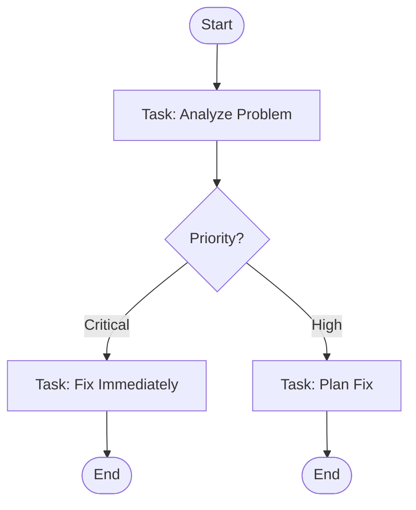

# Brainstorm: StandupMate como Sistema de Resolução de Problemas e Fluxos de Trabalho

## Visão Geral da Expansão

Transformar o StandupMate de um sistema simples de tracking de tickets em uma **plataforma completa de resolução de problemas, criação de fluxos e planejamento**, com visualização de diagramas.

---

## 1. Conceitos Principais

### 1.1. Workflow/Process Flow
**O que é:**
- Sequência de passos/tarefas que definem como um problema é resolvido
- Pode ser linear, com branches condicionais, ou paralelo
- Reutilizável e versionado (como templates)

**Exemplo de fluxo:**
```
[Início] → [Análise do Problema] → [Planejamento] → [Implementação] → [Teste] → [Deploy] → [Fim]
                ↓
            [Bloqueado?] → [Resolver Bloqueio] → [Retornar ao Planejamento]
```

### 1.2. Problem Solving Framework
**O que é:**
- Estrutura metodológica para resolver problemas (baseado no Problem Solving Roadmap atual)
- Guia o usuário através de etapas definidas
- Coleta dados estruturados em cada etapa
- Rastreia histórico e aprendizado

### 1.3. Process Automation
**O que é:**
- Automação de passos repetitivos
- Integração com ferramentas externas
- Notificações e lembretes
- Geração automática de documentos

---

## 2. Estrutura de Dados Proposta

### 2.1. Workflow (Novo Domain Entity)

```typescript
// src/core/domain/Workflow.ts

export class Workflow {
  constructor(
    public id: string,
    public name: string,
    public description: string,
    public version: string,
    public isDefault: boolean,
    public nodes: WorkflowNode[],        // Nós do diagrama
    public edges: WorkflowEdge[],        // Conexões entre nós
    public metadata: WorkflowMetadata,
    public createdAt: Date,
    public updatedAt: Date
  ) {}

  validate(): void {
    // Validações de workflow válido (não ciclos inválidos, etc.)
  }
}

export interface WorkflowNode {
  id: string;
  type: NodeType;              // START, TASK, DECISION, END, etc.
  label: string;
  position: { x: number; y: number };  // Para diagrama
  templateId?: string;         // Template associado (para TASK)
  config: NodeConfig;
  order: number;
}

export enum NodeType {
  START = 'start',
  TASK = 'task',              // Executa um template/ticket
  DECISION = 'decision',      // Branch condicional
  PARALLEL = 'parallel',      // Execução paralela
  MERGE = 'merge',            // Junta branches
  END = 'end',
  SUB_WORKFLOW = 'sub_workflow',  // Referência a outro workflow
}

export interface WorkflowEdge {
  id: string;
  sourceNodeId: string;
  targetNodeId: string;
  label?: string;             // Condição (para DECISION)
  condition?: EdgeCondition;  // Ex: "status === 'approved'"
}

export interface EdgeCondition {
  field: string;              // Campo do ticket/template
  operator: 'eq' | 'ne' | 'gt' | 'lt' | 'contains';
  value: any;
}
```

### 2.2. WorkflowInstance (Execução de um Workflow)

```typescript
// src/core/domain/WorkflowInstance.ts

export class WorkflowInstance {
  constructor(
    public id: string,
    public workflowId: string,
    public workflowVersion: string,
    public status: WorkflowStatus,
    public currentNodes: string[],      // Nós atualmente ativos
    public completedNodes: string[],    // Nós concluídos
    public tickets: Map<string, string>, // NodeId → TicketId
    public data: Record<string, any>,   // Dados compartilhados entre nós
    public createdAt: Date,
    public updatedAt: Date,
    public completedAt?: Date
  ) {}

  canProgressTo(nodeId: string): boolean {
    // Verifica se pode avançar para o próximo nó
  }

  executeNode(nodeId: string): Promise<void> {
    // Executa a lógica do nó (cria ticket, avalia condição, etc.)
  }
}

export enum WorkflowStatus {
  DRAFT = 'draft',
  RUNNING = 'running',
  PAUSED = 'paused',
  COMPLETED = 'completed',
  FAILED = 'failed',
}
```

### 2.3. Extensão do Template

```typescript
// Adicionar ao Template.ts existente

export class Template {
  // ... campos existentes
  
  workflowId?: string;        // Workflow que pode usar este template
  isWorkflowTask: boolean;    // Este template é usado em workflows?
}
```

---

## 3. Funcionalidades Principais

### 3.1. Workflow Builder (Editor Visual)

**UI:**
- Canvas drag & drop para criar nós e arestas
- Palette de tipos de nós (Start, Task, Decision, etc.)
- Propriedades de cada nó em painel lateral
- Validação em tempo real (sem ciclos, caminhos inválidos, etc.)

**Tecnologias sugeridas:**
- **React Flow** (https://reactflow.dev/) - Popular, performático, customizável
- **Cytoscape.js** - Mais poderosa, mas mais complexa
- **D3.js** - Máximo controle, mais trabalho
- **Mermaid** - Simples, renderiza de texto (para export)

**Arquivos a criar:**
- `src/app/components/workflow/WorkflowBuilder.tsx`
- `src/app/components/workflow/WorkflowCanvas.tsx`
- `src/app/components/workflow/WorkflowNodePalette.tsx`
- `src/app/components/workflow/WorkflowNodeEditor.tsx`

### 3.2. Workflow Runner (Executor)

**Funcionalidades:**
- Iniciar instância de workflow a partir de um workflow definido
- Criar tickets automaticamente quando chega em um nó TASK
- Avaliar condições DECISION baseadas em dados do ticket
- Avançar para próximos nós automaticamente ou manualmente
- Pausar/retomar workflow
- Mostrar progresso visual no diagrama

**Arquivos a criar:**
- `src/core/services/WorkflowRunner.ts`
- `src/app/components/workflow/WorkflowRunnerView.tsx`
- `src/app/pages/WorkflowInstancePage.tsx`

### 3.3. Visualização de Diagramas

**Tipos de visualização:**
1. **Diagrama do Workflow** (estrutura do processo)
2. **Diagrama de Progresso** (status atual da instância)
3. **Diagrama de Dependências** (quais tarefas dependem de outras)
4. **Timeline/Chronograma** (Gantt chart)

**Libraries sugeridas:**
- **React Flow** para diagramas interativos
- **Recharts** para gráficos/timeline (já instalado)
- **Mermaid** para exportação estática (texto para diagrama)

### 3.4. Problem Solving Templates

**Templates prontos para resolução de problemas:**
- **5 Whys** - Investigação de causa raiz
- **PDCA** (Plan-Do-Check-Act) - Ciclo de melhoria
- **A3 Problem Solving** - Metodologia Toyota
- **Ishikawa/Fishbone** - Diagrama de causa e efeito
- **Root Cause Analysis** - Análise estruturada

**Como implementar:**
- Workflows pré-definidos que guiam o usuário
- Templates associados a cada etapa do workflow
- Coleta automática de dados em cada etapa

---

## 4. Integrações e Automações

### 4.1. Integração com Tickets Existentes
- Workflow pode criar tickets automaticamente
- Tickets podem referenciar o workflow instance
- Status de tickets pode avançar o workflow

### 4.2. Integração com Calendário
- Planejamento de reuniões como tarefas do workflow
- Lembretes automáticos para próximas etapas
- Sincronização com Google Calendar / Outlook (futuro)

### 4.3. Automações
- **Webhooks** - Disparar ações externas
- **Conditions** - IF/THEN baseado em dados
- **Notifications** - Email/Toast quando etapa completa
- **Reports** - Gerar relatórios automáticos ao finalizar

---

## 5. Estrutura de Pastas Proposta

```
src/
├── core/
│   ├── domain/
│   │   ├── Workflow.ts           # Novo
│   │   ├── WorkflowInstance.ts   # Novo
│   │   ├── Template.ts           # Extendido
│   │   └── Ticket.ts             # Extendido (adicionar workflowInstanceId)
│   ├── services/
│   │   ├── WorkflowService.ts    # Novo - CRUD workflows
│   │   ├── WorkflowRunner.ts     # Novo - Executar workflows
│   │   └── WorkflowValidator.ts  # Novo - Validar workflows
│   └── interfaces/
│       ├── primary/
│       │   └── IWorkflowService.ts  # Novo
│       └── secondary/
│           └── IWorkflowRepository.ts  # Novo
│
├── infra/
│   ├── database/
│   │   ├── repositories/
│   │   │   └── SQLiteWorkflowRepository.ts  # Novo
│   │   └── mappers/
│   │       └── WorkflowMapper.ts  # Novo
│   └── visualization/
│       ├── ReactFlowAdapter.ts   # Novo - Adaptador para React Flow
│       └── MermaidExporter.ts    # Novo - Export para Mermaid
│
└── app/
    ├── components/
    │   ├── workflow/             # Novo diretório
    │   │   ├── WorkflowBuilder.tsx
    │   │   ├── WorkflowCanvas.tsx
    │   │   ├── WorkflowNodePalette.tsx
    │   │   ├── WorkflowNodeEditor.tsx
    │   │   ├── WorkflowRunnerView.tsx
    │   │   └── WorkflowDiagram.tsx
    │   └── diagram/
    │       ├── DiagramView.tsx   # Componente genérico
    │       └── GanttChart.tsx    # Timeline
    ├── pages/
    │   ├── WorkflowsPage.tsx     # Novo - Lista de workflows
    │   ├── WorkflowBuilderPage.tsx  # Novo - Editor
    │   └── WorkflowInstancePage.tsx # Novo - Execução
    └── hooks/
        ├── useWorkflows.ts       # Novo
        └── useWorkflowRunner.ts  # Novo
```

---

## 6. Tecnologias e Bibliotecas

### 6.1. Visualização de Diagramas

**React Flow** (Recomendado)
```bash
npm install reactflow
```
- ✅ Popular e bem mantido
- ✅ Drag & drop nativo
- ✅ Customização de nós e arestas
- ✅ Performático para diagramas grandes
- ✅ Export para SVG/PNG
- ✅ Zoom, pan, minimap

**Alternativa: Cytoscape.js**
- Mais poderosa para grafos complexos
- Layout automático avançado
- Mais pesada

### 6.2. Export de Diagramas

**Mermaid** (para export estático)
```bash
npm install mermaid
```
- Renderiza diagramas de texto
- Útil para documentação
- Suporte a vários tipos (flowchart, sequence, gantt)

### 6.3. Timeline/Gantt

**Recharts** (já instalado) ou **React Gantt Chart Timeline**
- Timeline visual de execução
- Dependências entre tarefas

---

## 7. Casos de Uso

### 7.1. Criar Processo de Bug Fixing

**Workflow:**
```
[Start] 
  → [Report Bug] (Template: Bug Report)
  → [Triage] (Decision: Priority)
    → [Critical] → [Fix Immediately] → [Test] → [Deploy Hotfix] → [End]
    → [High] → [Plan Fix] → [Fix] → [Code Review] → [Test] → [Deploy] → [End]
    → [Low] → [Add to Backlog] → [End]
```

**Benefícios:**
- Processo padronizado
- Rastreamento automático
- Garante todas as etapas são seguidas

### 7.2. Problem Solving Structured

**Workflow baseado no Problem Solving Roadmap:**
```
[Start]
  → [1. What Needs to be Done?] (Template: Problem Analysis)
  → [2. How Will I Know I'm Done?] (Template: Acceptance Criteria)
  → [3. Am I Prepared?] (Template: Preparation Checklist)
  → [Decision: Ready?]
    → [Yes] → [4. What's the Plan?] (Template: Planning)
    → [No] → [Resolve Blockers] → [3. Am I Prepared?]
  → [5. Executing] (Template: Execution Log)
  → [6. Before Delivery] (Template: Quality Checklist)
  → [7. For the Daily] (Template: Daily Update)
  → [8. Retrospective] (Template: Retrospective)
  → [End]
```

### 7.3. Planejamento de Sprint

**Workflow:**
```
[Start]
  → [Sprint Planning Meeting] (Task: Create Sprint Ticket)
  → [Breakdown Tasks] (Task: Create Subtasks)
  → [Estimate] (Task: Add Estimates)
  → [Assign] (Task: Assign to Team)
  → [Daily Standup] (Loop: Daily)
  → [Sprint Review] (Task: Review Completed)
  → [Sprint Retrospective] (Task: Retrospective)
  → [End]
```

---

## 8. Implementação por Fases

### Fase 1: Fundamentos (2-3 semanas)
- [ ] Domain models (Workflow, WorkflowInstance)
- [ ] Repository e Service básico (CRUD)
- [ ] Schema SQLite para workflows
- [ ] Workflow builder básico (React Flow)
- [ ] Salvar/carregar workflows

### Fase 2: Executor (2-3 semanas)
- [ ] WorkflowRunner service
- [ ] Criação automática de tickets
- [ ] Avaliação de condições (DECISION nodes)
- [ ] UI para executar workflow
- [ ] Rastreamento de progresso

### Fase 3: Visualizações (2 semanas)
- [ ] Diagrama de progresso em tempo real
- [ ] Timeline/Gantt chart
- [ ] Export para Mermaid
- [ ] Dashboard de workflows ativos

### Fase 4: Templates e Automações (2-3 semanas)
- [ ] Templates prontos (5 Whys, PDCA, etc.)
- [ ] Integração com tickets existentes
- [ ] Notificações
- [ ] Webhooks básicos

---

## 9. Questões para Decidir

### 9.1. Escopo Inicial
- **Opção A:** Focar apenas em workflows lineares (mais simples)
- **Opção B:** Suportar branches e paralelismo desde o início (mais complexo)

**Recomendação:** Opção A inicialmente, expandir depois.

### 9.2. Persistência de Diagramas
- Salvar posições dos nós no banco?
- Ou apenas estrutura (nós e arestas) e calcular layout?

**Recomendação:** Salvar posições para manter layout do usuário.

### 9.3. Versionamento
- Workflows versionados como templates?
- Workflow instances sempre usam versão específica?

**Recomendação:** Sim, como templates (para não quebrar instâncias em execução).

### 9.4. Integração com Tickets
- Ticket pode estar em múltiplos workflows?
- Workflow pode criar múltiplos tickets?

**Recomendação:** 
- Sim, ticket pode estar em múltiplos workflows (via workflowInstanceId + nodeId)
- Sim, workflow pode criar múltiplos tickets (um por TASK node)

---

## 10. Próximos Passos

1. **Validar conceito** - Confirmar se faz sentido para o caso de uso
2. **POC simples** - Implementar workflow linear básico (3-4 nós)
3. **Testar React Flow** - Criar protótipo do builder
4. **Decidir escopo** - O que incluir na primeira versão
5. **Criar plano detalhado** - Baseado nas decisões

---

## 11. Referências

- **React Flow:** https://reactflow.dev/
- **Mermaid:** https://mermaid.js.org/
- **Workflow Engines:** Airflow, Temporal (para referência de patterns)
- **BPMN 2.0:** Padrão para modelagem de processos (pode ser útil como referência)

---

## 12. Escopo Funcional Detalhado

### 12.1. Workflow Builder - Funcionalidades Completas

#### 12.1.1. Editor Visual de Diagramas

**Paleta de Nós:**
- **START** - Nó inicial (obrigatório, único)
- **TASK** - Tarefa que executa um Template (cria ticket)
- **DECISION** - Branch condicional (2+ saídas)
- **PARALLEL** - Inicia execução paralela
- **MERGE** - Junta branches paralelas
- **END** - Nó final (obrigatório, pelo menos 1)
- **SUB_WORKFLOW** - Chama outro workflow (recursão)

**Canvas:**
- Drag & drop de nós da paleta para o canvas
- Conectar nós arrastando de handle de saída para handle de entrada
- Zoom (mouse wheel ou botões)
- Pan (arrastar espaço vazio ou botão)
- Minimap (navegação rápida)
- Fit view (ajustar todos os nós na tela)
- Grid opcional (alinhamento)

**Interações:**
- Clique em nó → Abre painel de propriedades
- Double-click em nó → Edita label inline
- Delete → Remove nó e suas conexões
- Copy/Paste → Duplica nó com novo ID

**Validação em Tempo Real:**
- ✅ Exatamente 1 nó START
- ✅ Pelo menos 1 nó END
- ✅ Todos os nós conectados (sem nós órfãos)
- ✅ DECISION tem 2+ edges de saída
- ✅ PARALLEL tem MERGE correspondente
- ✅ Sem ciclos inválidos (exceto loops explícitos com DECISION)
- ✅ TASK tem templateId válido

#### 12.1.2. Editor de Propriedades de Nó

**Para TASK:**
- Label (nome do nó)
- Template associado (dropdown de templates disponíveis)
- Auto-create ticket? (criar automaticamente ou manualmente)
- Auto-advance? (avançar automaticamente quando ticket completado)
- Assignee padrão? (opcional)
- Due date offset? (dias relativos à criação)

**Para DECISION:**
- Label
- Condições por edge:
  - Campo do ticket a avaliar
  - Operador (eq, ne, gt, lt, contains, exists)
  - Valor esperado
  - Label da condição (ex: "Priority == High")

**Para START:**
- Label (geralmente "Start")
- Initial data (JSON opcional para dados iniciais do workflow)

**Para END:**
- Label (geralmente "End" ou "Success")
- Success message (opcional)

**Para PARALLEL/MERGE:**
- Label
- Wait for all? (PARALLEL: aguardar todas as branches ou qualquer uma)

#### 12.1.3. Gerenciamento de Workflows

**CRUD:**
- Criar novo workflow (blank ou a partir de template)
- Editar workflow existente
- Duplicar workflow
- Deletar workflow (com validação se tem instâncias em execução)
- Set as default

**Versionamento:**
- Criar nova versão (incrementa major version)
- Visualizar histórico de versões
- Rollback para versão anterior (cria nova versão)

**Import/Export:**
- Export workflow como JSON
- Import workflow de JSON
- Export como Mermaid (para documentação)
- Export como PNG/SVG (imagem)

### 12.2. Workflow Runner - Funcionalidades Completas

#### 12.2.1. Inicialização

**Criar Instância:**
- Selecionar workflow (dropdown ou lista)
- Parâmetros iniciais (opcional):
  - Nome/título da instância
  - Descrição
  - Dados iniciais (JSON)
  - Deadline (opcional)
- Ao criar: inicializa `currentNodes` com nó START

#### 12.2.2. Execução de Nós

**START Node:**
- Sem ação (apenas marca como completo)
- Inicializa `instance.data` com dados iniciais
- Avança automaticamente para próximos nós

**TASK Node:**
- Cria ticket automaticamente (se auto-create = true):
  - Usa template associado ao nó
  - Preenche dados iniciais do workflow
  - Vincula ticket ao `workflowInstanceId` e `nodeId`
  - Adiciona ao mapa `tickets: Map<nodeId, ticketId>`
- Marca nó como "active" (aguardando ticket)
- Quando ticket completado:
  - Se auto-advance = true → Avança automaticamente
  - Se auto-advance = false → Espera ação manual do usuário
- Atualiza `instance.data` com dados do ticket

**DECISION Node:**
- Avalia condições em ordem
- Primeira condição que satisfaz → segue por aquele edge
- Se nenhuma condição satisfaz → erro ou edge default
- Marca nó como completo após avaliação
- Avança automaticamente para nó escolhido

**PARALLEL Node:**
- Cria instâncias paralelas (sub-executions)
- Marca nó como completo imediatamente
- Avança para TODOS os nós conectados (ou qualquer um, dependendo de config)

**MERGE Node:**
- Aguarda todas as branches chegarem (se wait-for-all = true)
- Ou continua quando qualquer branch chegar (wait-for-all = false)
- Marca nó como completo
- Avança para próximo nó

**END Node:**
- Marca workflow instance como COMPLETED
- Salva `completedAt`
- Notifica usuário (toast)
- Opcional: Gera relatório final

#### 12.2.3. Controles de Execução

**Manual:**
- Botão "Advance" (avança para próximo nó quando possível)
- Botão "Pause" (pausa execução)
- Botão "Resume" (retoma execução pausada)
- Botão "Cancel" (cancela workflow, marca como FAILED)
- Botão "Reset" (volta para início - cria nova instância)

**Automático:**
- Auto-advance baseado em configuração do nó
- Auto-pause em caso de erro
- Auto-notification quando etapa completa

#### 12.2.4. Visualização de Progresso

**No Diagrama:**
- Nós marcados por status:
  - 🟢 Green: Completed
  - 🟡 Yellow: Active (current)
  - ⚪ Gray: Pending (não iniciado)
  - 🔴 Red: Blocked/Failed
- Edges marcados por status:
  - Verde: Caminho tomado
  - Cinza: Caminho não tomado (em DECISION)
  - Vermelho: Caminho com erro

**Painel Lateral:**
- Status geral da instância
- Nós ativos (currentNodes)
- Nós completados (completedNodes)
- Tickets criados (links clicáveis)
- Dados do workflow (instance.data)
- Timeline de execução

### 12.3. Visualizações e Relatórios

#### 12.3.1. Diagrama de Progresso em Tempo Real

**React Flow com Estados:**
- Componente `WorkflowProgressDiagram.tsx`
- Recebe `Workflow` (estrutura) + `WorkflowInstance` (estado)
- Renderiza nós com cores baseadas no estado
- Atualiza em tempo real quando workflow avança

#### 12.3.2. Timeline/Gantt Chart

**Recharts ou React Gantt:**
- Eixo X: Tempo (datas/horas)
- Eixo Y: Nós do workflow
- Barras coloridas por status
- Mostra dependências (linhas conectando nós)
- Mostra estimativas vs real (se houver)

**Dados para Timeline:**
```typescript
interface TimelineNode {
  nodeId: string;
  label: string;
  startTime: Date;
  endTime?: Date;
  estimatedDuration?: number;
  actualDuration?: number;
  status: 'pending' | 'active' | 'completed' | 'blocked';
  dependencies: string[]; // NodeIds que devem completar antes
}
```

#### 12.3.3. Export para Mermaid

**Formato:**


**Implementação:**
- Serviço `MermaidExporter.ts`
- Converte `Workflow` (nodes + edges) para string Mermaid
- Suporta diferentes estilos (flowchart, graph, etc.)

#### 12.3.4. Dashboard de Workflows Ativos

**Métricas:**
- Total de workflows definidos
- Total de instâncias ativas
- Instâncias por status (running, paused, completed)
- Workflows mais usados
- Tempo médio de execução por workflow
- Taxa de conclusão

**Lista:**
- Instâncias em execução (running)
- Instâncias pausadas (paused)
- Instâncias recentemente completadas
- Filtros por status, workflow, data

---

## 13. Arquitetura Técnica Detalhada

### 13.1. Domain Models Completos

```typescript
// src/core/domain/Workflow.ts

export class Workflow {
  constructor(
    public id: string,
    public name: string,
    public description: string,
    public version: string,
    public isDefault: boolean,
    public nodes: WorkflowNode[],
    public edges: WorkflowEdge[],
    public metadata: WorkflowMetadata,
    public createdAt: Date,
    public updatedAt: Date,
    public author?: string
  ) {}

  validate(): void {
    // Validações de negócio
    this.validateStructure();
    this.validateConnections();
    this.validateNodeConfigs();
  }

  private validateStructure(): void {
    const startNodes = this.nodes.filter(n => n.type === NodeType.START);
    const endNodes = this.nodes.filter(n => n.type === NodeType.END);

    if (startNodes.length !== 1) {
      throw new Error('Workflow must have exactly one START node');
    }

    if (endNodes.length === 0) {
      throw new Error('Workflow must have at least one END node');
    }

    // Verificar IDs únicos
    const nodeIds = new Set(this.nodes.map(n => n.id));
    if (nodeIds.size !== this.nodes.length) {
      throw new Error('Duplicate node IDs found');
    }
  }

  private validateConnections(): void {
    // Verificar se todos os edges referenciam nós existentes
    const nodeIds = new Set(this.nodes.map(n => n.id));
    
    for (const edge of this.edges) {
      if (!nodeIds.has(edge.sourceNodeId)) {
        throw new Error(`Edge references non-existent source node: ${edge.sourceNodeId}`);
      }
      if (!nodeIds.has(edge.targetNodeId)) {
        throw new Error(`Edge references non-existent target node: ${edge.targetNodeId}`);
      }
    }

    // Verificar se todos os nós têm pelo menos uma conexão (exceto START e END)
    // START deve ter ao menos uma saída
    // END deve ter ao menos uma entrada
    // Outros nós devem ter entrada E saída (exceto DECISION que pode ter múltiplas saídas)
  }

  private validateNodeConfigs(): void {
    for (const node of this.nodes) {
      if (node.type === NodeType.TASK && !node.templateId) {
        throw new Error(`TASK node ${node.id} must have a templateId`);
      }

      if (node.type === NodeType.DECISION) {
        const outgoingEdges = this.edges.filter(e => e.sourceNodeId === node.id);
        if (outgoingEdges.length < 2) {
          throw new Error(`DECISION node ${node.id} must have at least 2 outgoing edges`);
        }
        // Verificar se todas as edges têm condições
        for (const edge of outgoingEdges) {
          if (!edge.condition && outgoingEdges.indexOf(edge) !== outgoingEdges.length - 1) {
            throw new Error(`DECISION edge ${edge.id} must have a condition (except the last/default edge)`);
          }
        }
      }
    }
  }

  getNodeById(nodeId: string): WorkflowNode | null {
    return this.nodes.find(n => n.id === nodeId) || null;
  }

  getOutgoingEdges(nodeId: string): WorkflowEdge[] {
    return this.edges.filter(e => e.sourceNodeId === nodeId);
  }

  getIncomingEdges(nodeId: string): WorkflowEdge[] {
    return this.edges.filter(e => e.targetNodeId === nodeId);
  }

  getNextNodes(nodeId: string): WorkflowNode[] {
    const outgoingEdges = this.getOutgoingEdges(nodeId);
    return outgoingEdges.map(e => this.getNodeById(e.targetNodeId)!).filter(Boolean);
  }

  getPreviousNodes(nodeId: string): WorkflowNode[] {
    const incomingEdges = this.getIncomingEdges(nodeId);
    return incomingEdges.map(e => this.getNodeById(e.sourceNodeId)!).filter(Boolean);
  }

  createNewVersion(): Workflow {
    const newVersion = this.incrementMajorVersion(this.version);
    return new Workflow(
      `workflow-${Date.now()}`,
      this.name,
      this.description,
      newVersion,
      false,
      JSON.parse(JSON.stringify(this.nodes)),
      JSON.parse(JSON.stringify(this.edges)),
      this.metadata,
      new Date(),
      new Date(),
      this.author
    );
  }

  private incrementMajorVersion(version: string): string {
    const parts = version.split('.');
    const major = parseInt(parts[0], 10);
    return `${major + 1}.0.0`;
  }
}

export interface WorkflowNode {
  id: string;
  type: NodeType;
  label: string;
  position: { x: number; y: number };
  templateId?: string;              // Para TASK nodes
  config: NodeConfig;
  order?: number;                    // Ordem de execução (se aplicável)
}

export interface NodeConfig {
  // Para TASK
  autoCreateTicket?: boolean;        // Criar ticket automaticamente
  autoAdvance?: boolean;             // Avançar automaticamente quando ticket completo
  assignee?: string;                 // Assignee padrão
  dueDateOffset?: number;            // Dias até due date
  
  // Para DECISION
  evaluationOrder?: 'first' | 'all'; // Avaliar primeira condição ou todas
  
  // Para PARALLEL
  waitForAll?: boolean;              // Aguardar todas branches ou qualquer uma
  
  // Para MERGE
  mergeStrategy?: 'all' | 'first';   // Merge quando todas chegam ou primeira chegar
}

export interface WorkflowEdge {
  id: string;
  sourceNodeId: string;
  targetNodeId: string;
  label?: string;                    // Label da aresta (ex: "Yes", "High Priority")
  condition?: EdgeCondition;         // Condição para DECISION edges
  order?: number;                    // Ordem de avaliação (para DECISION)
}

export interface EdgeCondition {
  field: string;                     // Campo do ticket a avaliar
  operator: 'eq' | 'ne' | 'gt' | 'lt' | 'gte' | 'lte' | 'contains' | 'exists' | 'in';
  value: any;                        // Valor esperado
}

export interface WorkflowMetadata {
  tags?: string[];
  category?: string;
  estimatedDuration?: number;        // Duração estimada total (minutos)
  complexity?: 'low' | 'medium' | 'high';
}
```

```typescript
// src/core/domain/WorkflowInstance.ts

export class WorkflowInstance {
  constructor(
    public id: string,
    public workflowId: string,
    public workflowVersion: string,
    public status: WorkflowStatus,
    public currentNodes: string[],               // IDs dos nós atualmente ativos
    public completedNodes: string[],            // IDs dos nós já completados
    public tickets: Map<string, string>,        // Map<nodeId, ticketId>
    public data: Record<string, any>,           // Dados compartilhados entre nós
    public metadata: WorkflowInstanceMetadata,
    public createdAt: Date,
    public updatedAt: Date,
    public completedAt?: Date,
    public failedAt?: Date,
    public errorMessage?: string
  ) {}

  canProgressTo(nodeId: string, workflow: Workflow): boolean {
    // Verifica se todos os nós predecessores estão completos
    const previousNodes = workflow.getPreviousNodes(nodeId);
    return previousNodes.every(prev => this.completedNodes.includes(prev.id));
  }

  markNodeCompleted(nodeId: string): void {
    if (!this.completedNodes.includes(nodeId)) {
      this.completedNodes.push(nodeId);
    }
    this.currentNodes = this.currentNodes.filter(id => id !== nodeId);
    this.updatedAt = new Date();
  }

  markNodeActive(nodeId: string): void {
    if (!this.currentNodes.includes(nodeId)) {
      this.currentNodes.push(nodeId);
    }
    this.updatedAt = new Date();
  }

  setTicketForNode(nodeId: string, ticketId: string): void {
    this.tickets.set(nodeId, ticketId);
    this.updatedAt = new Date();
  }

  getTicketForNode(nodeId: string): string | undefined {
    return this.tickets.get(nodeId);
  }

  updateData(key: string, value: any): void {
    this.data[key] = value;
    this.updatedAt = new Date();
  }

  markCompleted(): void {
    this.status = WorkflowStatus.COMPLETED;
    this.completedAt = new Date();
    this.currentNodes = [];
    this.updatedAt = new Date();
  }

  markFailed(error: string): void {
    this.status = WorkflowStatus.FAILED;
    this.failedAt = new Date();
    this.errorMessage = error;
    this.updatedAt = new Date();
  }

  pause(): void {
    if (this.status === WorkflowStatus.RUNNING) {
      this.status = WorkflowStatus.PAUSED;
      this.updatedAt = new Date();
    }
  }

  resume(): void {
    if (this.status === WorkflowStatus.PAUSED) {
      this.status = WorkflowStatus.RUNNING;
      this.updatedAt = new Date();
    }
  }

  getProgress(): number {
    // Calcula % de progresso baseado em nós completados
    // Requer workflow para saber total de nós
    return 0; // Implementar
  }
}

export interface WorkflowInstanceMetadata {
  name?: string;                     // Nome personalizado da instância
  description?: string;
  deadline?: Date;
  assignee?: string;
  tags?: string[];
}
```

### 13.2. Extensões de Domain Models Existentes

```typescript
// Extensão do Ticket.ts

export class Ticket {
  // ... campos existentes
  
  workflowInstanceId?: string;      // ID da instância de workflow (se aplicável)
  workflowNodeId?: string;           // ID do nó que criou este ticket (se aplicável)
  
  // ... métodos existentes
}
```

```typescript
// Extensão do Template.ts

export class Template {
  // ... campos existentes
  
  isWorkflowTask?: boolean;          // Este template pode ser usado em workflows?
  workflowId?: string;               // Workflow que usa este template (referência opcional)
  
  // ... métodos existentes
}
```

### 13.3. Service Interfaces

```typescript
// src/core/interfaces/primary/IWorkflowService.ts

export interface IWorkflowService {
  // CRUD
  createWorkflow(workflow: Workflow): Promise<Workflow>;
  updateWorkflow(id: string, workflow: Workflow): Promise<Workflow>;
  getWorkflow(id: string): Promise<Workflow | null>;
  listWorkflows(): Promise<Workflow[]>;
  deleteWorkflow(id: string): Promise<boolean>;
  
  // Versionamento
  createNewVersion(id: string): Promise<Workflow>;
  getWorkflowVersions(id: string): Promise<Workflow[]>;
  
  // Default
  setAsDefault(id: string): Promise<Workflow>;
  getDefaultWorkflow(): Promise<Workflow | null>;
  
  // Validação
  validateWorkflow(workflow: Workflow): Promise<ValidationResult>;
  
  // Import/Export
  exportToJSON(id: string): Promise<string>;
  importFromJSON(json: string): Promise<Workflow>;
  exportToMermaid(id: string): Promise<string>;
}

export interface ValidationResult {
  isValid: boolean;
  errors: string[];
  warnings: string[];
}
```

```typescript
// src/core/services/WorkflowRunner.ts

export class WorkflowRunner {
  constructor(
    private workflowService: IWorkflowService,
    private ticketService: ITicketService,
    private workflowInstanceRepository: IWorkflowInstanceRepository
  ) {}

  async startInstance(
    workflowId: string,
    metadata?: WorkflowInstanceMetadata,
    initialData?: Record<string, any>
  ): Promise<WorkflowInstance> {
    // 1. Carregar workflow
    // 2. Validar workflow
    // 3. Criar instância
    // 4. Executar nó START
    // 5. Salvar instância
    // 6. Retornar instância
  }

  async executeNode(
    instanceId: string,
    nodeId: string
  ): Promise<void> {
    // 1. Carregar instância
    // 2. Carregar workflow
    // 3. Verificar se pode executar nó
    // 4. Executar lógica do nó (criar ticket, avaliar condição, etc.)
    // 5. Atualizar instância
    // 6. Avançar para próximos nós (se aplicável)
  }

  async advance(instanceId: string): Promise<void> {
    // Avança workflow manualmente para próximos nós disponíveis
  }

  async pause(instanceId: string): Promise<void> {
    // Pausa execução
  }

  async resume(instanceId: string): Promise<void> {
    // Retoma execução
  }

  async cancel(instanceId: string, reason?: string): Promise<void> {
    // Cancela execução
  }

  async evaluateDecision(
    instance: WorkflowInstance,
    nodeId: string,
    workflow: Workflow
  ): Promise<string | null> {
    // Avalia condições DECISION e retorna nodeId do próximo nó
  }

  private async createTicketForTaskNode(
    instance: WorkflowInstance,
    node: WorkflowNode,
    workflow: Workflow
  ): Promise<Ticket> {
    // Cria ticket usando template associado ao nó
  }
}
```

### 13.4. Repository Interfaces

```typescript
// src/core/interfaces/secondary/IWorkflowRepository.ts

export interface IWorkflowRepository {
  findAll(): Promise<Workflow[]>;
  findById(id: string): Promise<Workflow | null>;
  findDefault(): Promise<Workflow | null>;
  findByVersion(id: string, version: string): Promise<Workflow | null>;
  save(workflow: Workflow): Promise<Workflow>;
  delete(id: string): Promise<boolean>;
  count(): Promise<number>;
}

// src/core/interfaces/secondary/IWorkflowInstanceRepository.ts

export interface IWorkflowInstanceRepository {
  findAll(filter?: WorkflowInstanceFilter): Promise<WorkflowInstance[]>;
  findById(id: string): Promise<WorkflowInstance | null>;
  findByWorkflowId(workflowId: string): Promise<WorkflowInstance[]>;
  findByStatus(status: WorkflowStatus): Promise<WorkflowInstance[]>;
  save(instance: WorkflowInstance): Promise<WorkflowInstance>;
  delete(id: string): Promise<boolean>;
  count(filter?: WorkflowInstanceFilter): Promise<number>;
}

export interface WorkflowInstanceFilter {
  workflowId?: string;
  status?: WorkflowStatus;
  assignee?: string;
  createdFrom?: Date;
  createdTo?: Date;
}
```

### 13.5. Database Schema

```sql
-- Workflows table
CREATE TABLE workflows (
  id TEXT PRIMARY KEY,
  name TEXT NOT NULL,
  description TEXT DEFAULT '',
  version TEXT NOT NULL,
  is_default INTEGER NOT NULL DEFAULT 0,
  nodes_json TEXT NOT NULL,           -- JSON array of WorkflowNode
  edges_json TEXT NOT NULL,           -- JSON array of WorkflowEdge
  metadata_json TEXT NOT NULL,        -- JSON object
  created_at TEXT NOT NULL,
  updated_at TEXT NOT NULL,
  author TEXT,
  UNIQUE(name, version)
);

CREATE INDEX idx_workflows_is_default ON workflows(is_default);
CREATE INDEX idx_workflows_name ON workflows(name);

-- Workflow Instances table
CREATE TABLE workflow_instances (
  id TEXT PRIMARY KEY,
  workflow_id TEXT NOT NULL,
  workflow_version TEXT NOT NULL,
  status TEXT NOT NULL,
  current_nodes_json TEXT NOT NULL,   -- JSON array of node IDs
  completed_nodes_json TEXT NOT NULL, -- JSON array of node IDs
  tickets_json TEXT NOT NULL,         -- JSON object {nodeId: ticketId}
  data_json TEXT NOT NULL,            -- JSON object (shared data)
  metadata_json TEXT NOT NULL,        -- JSON object
  created_at TEXT NOT NULL,
  updated_at TEXT NOT NULL,
  completed_at TEXT,
  failed_at TEXT,
  error_message TEXT,
  FOREIGN KEY (workflow_id) REFERENCES workflows(id)
);

CREATE INDEX idx_workflow_instances_workflow_id ON workflow_instances(workflow_id);
CREATE INDEX idx_workflow_instances_status ON workflow_instances(status);
CREATE INDEX idx_workflow_instances_created_at ON workflow_instances(created_at);

-- Extensão da tabela tickets existente
ALTER TABLE tickets ADD COLUMN workflow_instance_id TEXT;
ALTER TABLE tickets ADD COLUMN workflow_node_id TEXT;
CREATE INDEX idx_tickets_workflow_instance_id ON tickets(workflow_instance_id);
```

---

## 14. MVP Recortado - Fase 1 (Simplificado)

### 14.1. Escopo do MVP

**Funcionalidades Incluídas:**
- ✅ Workflows lineares apenas (START → TASK(s) → END)
- ✅ Apenas nós: START, TASK, END
- ✅ Sem DECISION, PARALLEL, MERGE, SUB_WORKFLOW
- ✅ CRUD básico de workflows
- ✅ Builder visual básico (criar/conectar nós)
- ✅ Executor manual (botão "Advance")
- ✅ Criação automática de tickets em TASK nodes
- ✅ Visualização de progresso no diagrama
- ✅ Export para Mermaid

**Funcionalidades Excluídas (para depois):**
- ❌ Branches condicionais (DECISION)
- ❌ Execução paralela (PARALLEL/MERGE)
- ❌ Sub-workflows
- ❌ Auto-advance baseado em status de ticket
- ❌ Timeline/Gantt chart
- ❌ Automações avançadas

### 14.2. Workflow Linear - Exemplo

```
[START] → [TASK: Analyze Problem] → [TASK: Plan Solution] → [TASK: Implement] → [TASK: Test] → [END]
```

**Fluxo de Execução:**
1. Criar instância → Marca START como active
2. Usuário clica "Advance" → START completa, TASK 1 cria ticket
3. Usuário trabalha no ticket 1
4. Usuário completa ticket 1 → Marca TASK 1 como completo
5. Usuário clica "Advance" → TASK 2 cria ticket
6. ... continua até END

---

## 15. Backlog Técnico - Fase 1 (MVP)

### 15.1. Domain Layer

- [ ] **Workflow.ts**
  - [ ] Classe Workflow com validações básicas
  - [ ] Métodos: validate(), getNodeById(), getNextNodes(), createNewVersion()
  - [ ] Testes unitários (100% coverage)

- [ ] **WorkflowInstance.ts**
  - [ ] Classe WorkflowInstance
  - [ ] Métodos: canProgressTo(), markNodeCompleted(), markNodeActive(), setTicketForNode()
  - [ ] Testes unitários (100% coverage)

- [ ] **Extensões**
  - [ ] Adicionar workflowInstanceId e workflowNodeId ao Ticket
  - [ ] Adicionar isWorkflowTask ao Template
  - [ ] Testes unitários

### 15.2. Interfaces (Ports)

- [ ] **IWorkflowService.ts**
  - [ ] Interface com métodos CRUD, versionamento, validação, import/export

- [ ] **IWorkflowRepository.ts**
  - [ ] Interface com métodos de persistência

- [ ] **IWorkflowInstanceRepository.ts**
  - [ ] Interface com métodos de persistência de instâncias

### 15.3. Services (Business Logic)

- [ ] **WorkflowService.ts**
  - [ ] Implementação de IWorkflowService
  - [ ] CRUD workflows
  - [ ] Validação de workflow (estrutura linear)
  - [ ] Versionamento
  - [ ] Export/Import JSON e Mermaid
  - [ ] Testes unitários com mocks (90%+ coverage)

- [ ] **WorkflowValidator.ts**
  - [ ] Validação de estrutura (1 START, 1+ END, linear)
  - [ ] Validação de conexões (sem ciclos, todos conectados)
  - [ ] Validação de configurações de nós
  - [ ] Testes unitários

- [ ] **WorkflowRunner.ts** (MVP simplificado)
  - [ ] startInstance() - Criar instância e executar START
  - [ ] executeNode() - Executar nó TASK (criar ticket)
  - [ ] advance() - Avançar manualmente para próximo nó
  - [ ] pause(), resume(), cancel()
  - [ ] createTicketForTaskNode() - Criar ticket vinculado
  - [ ] Testes unitários com mocks (80%+ coverage)

### 15.4. Infrastructure (Adapters)

- [ ] **Database Schema**
  - [ ] CREATE TABLE workflows
  - [ ] CREATE TABLE workflow_instances
  - [ ] ALTER TABLE tickets (adicionar colunas workflow)
  - [ ] Indexes

- [ ] **WorkflowMapper.ts**
  - [ ] toDomain() - Row → Workflow
  - [ ] fromDomain() - Workflow → Row
  - [ ] Parsing de nodes_json e edges_json
  - [ ] Testes de conversão

- [ ] **WorkflowInstanceMapper.ts**
  - [ ] toDomain() - Row → WorkflowInstance
  - [ ] fromDomain() - WorkflowInstance → Row
  - [ ] Parsing de JSONs (currentNodes, completedNodes, tickets, data)
  - [ ] Testes de conversão

- [ ] **SQLiteWorkflowRepository.ts**
  - [ ] Implementação de IWorkflowRepository
  - [ ] CRUD com SQLite
  - [ ] Testes de integração (80%+ coverage)

- [ ] **SQLiteWorkflowInstanceRepository.ts**
  - [ ] Implementação de IWorkflowInstanceRepository
  - [ ] CRUD com SQLite
  - [ ] Filtros por workflowId, status, etc.
  - [ ] Testes de integração (80%+ coverage)

- [ ] **MermaidExporter.ts**
  - [ ] Export Workflow para string Mermaid
  - [ ] Suporte a flowchart TD (top-down)
  - [ ] Formatação de labels e condições
  - [ ] Testes unitários

### 15.5. UI Components

- [ ] **Instalação de React Flow**
  ```bash
  npm install reactflow
  ```

- [ ] **WorkflowBuilder.tsx**
  - [ ] Canvas React Flow
  - [ ] Paleta de nós (START, TASK, END apenas no MVP)
  - [ ] Drag & drop de nós
  - [ ] Conectar nós (edges)
  - [ ] Editar propriedades de nós (painel lateral)
  - [ ] Validação visual (toasts)

- [ ] **WorkflowCanvas.tsx**
  - [ ] Componente React Flow isolado
  - [ ] Zoom, pan, minimap
  - [ ] Handlers de eventos (onNodeClick, onConnect, etc.)

- [ ] **WorkflowNodePalette.tsx**
  - [ ] Lista de tipos de nós disponíveis
  - [ ] Drag & drop para canvas

- [ ] **WorkflowNodeEditor.tsx**
  - [ ] Formulário para editar propriedades do nó
  - [ ] Para TASK: selecionar template
  - [ ] Validação inline

- [ ] **WorkflowProgressDiagram.tsx**
  - [ ] Diagrama React Flow com estados
  - [ ] Cores baseadas em status (completed, active, pending)
  - [ ] Tooltips com informações do nó

### 15.6. Pages

- [ ] **WorkflowsPage.tsx**
  - [ ] Lista de workflows
  - [ ] Botões: New, Edit, Duplicate, Delete, Set Default
  - [ ] Busca/filtros
  - [ ] Export JSON/Mermaid

- [ ] **WorkflowBuilderPage.tsx**
  - [ ] Integra WorkflowBuilder
  - [ ] Header com botões: Save, Cancel, Validate, Export
  - [ ] Validação antes de salvar

- [ ] **WorkflowInstancePage.tsx**
  - [ ] Header com status e controles (Pause, Resume, Cancel)
  - [ ] WorkflowProgressDiagram (diagrama com progresso)
  - [ ] Painel lateral: Nós ativos, Tickets criados, Dados
  - [ ] Botão "Advance" (avança workflow manualmente)
  - [ ] Lista de tickets vinculados (links clicáveis)

### 15.7. Hooks

- [ ] **useWorkflows.ts**
  - [ ] loadWorkflows()
  - [ ] createWorkflow()
  - [ ] updateWorkflow()
  - [ ] deleteWorkflow()
  - [ ] setAsDefault()
  - [ ] exportToJSON()
  - [ ] importFromJSON()
  - [ ] exportToMermaid()

- [ ] **useWorkflowRunner.ts**
  - [ ] startInstance()
  - [ ] loadInstance()
  - [ ] advance()
  - [ ] pause()
  - [ ] resume()
  - [ ] cancel()

### 15.8. Routes

- [ ] Adicionar rotas em `App.tsx`:
  - [ ] `/workflows` → WorkflowsPage
  - [ ] `/workflows/builder/new` → WorkflowBuilderPage
  - [ ] `/workflows/builder/:id` → WorkflowBuilderPage
  - [ ] `/workflows/instances/:id` → WorkflowInstancePage

### 15.9. Service Factory

- [ ] Adicionar em `serviceFactory.ts`:
  - [ ] `createWorkflowService()`
  - [ ] `createWorkflowRunner()`

### 15.10. Integração com Tickets

- [ ] **TicketEditPage.tsx**
  - [ ] Mostrar badge se ticket está em workflow
  - [ ] Link para WorkflowInstancePage
  - [ ] Quando ticket completo, opção de avançar workflow

- [ ] **TicketList.tsx**
  - [ ] Filtrar por workflowInstanceId
  - [ ] Badge mostrando workflow

---

## 16. Regras de Negócio Detalhadas

### 16.1. Validação de Workflow

**Estrutura Básica:**
- Deve ter exatamente 1 nó START
- Deve ter pelo menos 1 nó END
- Todos os nós devem ter IDs únicos
- Todos os nós devem estar conectados (sem nós órfãos)

**Conexões:**
- START deve ter pelo menos 1 edge de saída
- END deve ter pelo menos 1 edge de entrada
- TASK deve ter exatamente 1 edge de entrada e 1 edge de saída (no MVP linear)
- Não pode ter ciclos (exceto loops explícitos - não no MVP)

**Configuração de Nós:**
- TASK deve ter templateId válido (template existente)
- TASK deve ter template com isWorkflowTask = true (opcional, validação leve)

### 16.2. Execução de Workflow

**Inicialização:**
- Ao criar instância, marca START como active
- Inicializa instance.data com dados iniciais (se fornecidos)
- Status inicial: RUNNING

**Execução de Nó START:**
- Sem ação específica
- Marca como completo imediatamente
- Avança automaticamente para próximo nó (única saída)

**Execução de Nó TASK:**
- Se autoCreateTicket = true:
  - Cria ticket usando template associado
  - Preenche ticket.data com instance.data
  - Vincula ticket (workflowInstanceId, workflowNodeId)
  - Salva ticket
  - Adiciona ao mapa instance.tickets
- Marca nó como "active" (aguardando)
- Se autoAdvance = true e ticket completado → avança automaticamente
- Se autoAdvance = false → aguarda ação manual

**Execução de Nó END:**
- Marca instância como COMPLETED
- Salva completedAt
- Limpa currentNodes
- Notifica usuário

**Avanço Manual:**
- Verifica se todos os nós predecessores estão completos
- Se sim, executa próximo nó
- Se não, erro ou aguarda

### 16.3. Versionamento

**Criar Nova Versão:**
- Incrementa major version (1.0.0 → 2.0.0)
- Cria novo ID de workflow
- Copia nodes e edges
- Não quebra instâncias existentes (elas usam workflowVersion específica)

**Instâncias:**
- Instância sempre referencia workflowVersion específica
- Não atualiza mesmo se workflow mudar
- Permite concluir instância com workflow antigo

### 16.4. Tickets em Workflow

**Criação:**
- Ticket criado automaticamente em TASK node
- Herda dados de instance.data
- workflowInstanceId e workflowNodeId preenchidos
- Status inicial: DRAFT ou IN_PROGRESS (configurável)

**Atualização:**
- Quando ticket atualizado, pode atualizar instance.data (se configurado)
- Quando ticket completado, pode avançar workflow (se autoAdvance = true)

**Vinculação Manual:**
- Permite vincular ticket existente a workflow node (opcional)
- Útil para workflows iniciados manualmente

---

## 17. Fluxos de Execução Detalhados

### 17.1. Criar e Executar Workflow Linear

**Passo 1: Criar Workflow**
1. Usuário acessa `/workflows/builder/new`
2. Arrasta nó START para canvas
3. Arrasta nó TASK para canvas
4. Conecta START → TASK
5. Seleciona TASK → Escolhe template no painel
6. Repete para mais TASK nodes e END
7. Clica "Save" → Valida workflow → Salva

**Passo 2: Iniciar Instância**
1. Usuário acessa `/workflows` → Seleciona workflow
2. Clica "Start Instance"
3. Preenche parâmetros iniciais (opcional)
4. Clica "Start"
5. Sistema:
   - Cria WorkflowInstance
   - Marca START como active
   - Salva instância
   - Redireciona para `/workflows/instances/:id`

**Passo 3: Executar Instância**
1. Usuário vê diagrama com START destacado
2. Clica "Advance"
3. Sistema:
   - Marca START como completo
   - Executa próximo nó (TASK)
   - Cria ticket automaticamente
   - Marca TASK como active
   - Atualiza diagrama

4. Usuário vê ticket criado (link clicável)
5. Usuário trabalha no ticket (abre TicketEditPage)
6. Usuário completa ticket
7. Usuário volta para WorkflowInstancePage
8. Clica "Advance" novamente
9. Sistema:
   - Marca TASK atual como completo
   - Executa próximo TASK
   - Cria novo ticket
   - ... repete até END

**Passo 4: Conclusão**
1. Quando chega em END
2. Sistema marca instância como COMPLETED
3. Notifica usuário (toast)
4. Mostra resumo final

### 17.2. Pausar e Retomar

**Pausar:**
1. Durante execução, usuário clica "Pause"
2. Sistema marca status como PAUSED
3. Nós ativos continuam ativos (mas não avança)

**Retomar:**
1. Usuário clica "Resume"
2. Sistema marca status como RUNNING
3. Workflow continua de onde parou

---

## 18. Estimativas e Prioridades

### 18.1. Estimativas por Componente

| Componente | Estimativa | Prioridade |
|------------|------------|------------|
| Domain Models | 1-2 dias | 🔴 Alta |
| Interfaces | 0.5 dia | 🔴 Alta |
| Services (CRUD) | 2-3 dias | 🔴 Alta |
| WorkflowRunner (MVP) | 2-3 dias | 🔴 Alta |
| Database Schema + Mappers | 1-2 dias | 🔴 Alta |
| Repositories | 1-2 dias | 🔴 Alta |
| React Flow Setup | 1 dia | 🟡 Média |
| WorkflowBuilder UI | 3-4 dias | 🟡 Média |
| WorkflowInstancePage | 2-3 dias | 🟡 Média |
| Hooks | 1 dia | 🟡 Média |
| Integração Tickets | 1 dia | 🟢 Baixa |
| Mermaid Export | 0.5 dia | 🟢 Baixa |
| **Total Fase 1** | **15-20 dias** | |

### 18.2. Sequência Recomendada

**Semana 1:**
- Domain models + Interfaces
- Database schema + Mappers
- Repositories + Services (CRUD)

**Semana 2:**
- WorkflowRunner (MVP)
- React Flow setup
- WorkflowBuilder UI básico

**Semana 3:**
- WorkflowInstancePage
- Integração com tickets
- Hooks e integrações

**Semana 4:**
- Polish, testes, bugs
- Mermaid export
- Documentação

---

## 19. Riscos e Mitigações

### 19.1. Complexidade de React Flow

**Risco:** Curva de aprendizado do React Flow pode atrasar desenvolvimento.

**Mitigação:**
- Começar com exemplos básicos
- Criar componentes wrapper para simplificar
- Documentar padrões comuns

### 19.2. Validação de Workflow

**Risco:** Workflows inválidos podem quebrar execução.

**Mitigação:**
- Validação rigorosa antes de salvar
- Validação antes de executar instância
- Testes unitários extensivos

### 19.3. Performance com Muitos Nós

**Risco:** Diagramas com muitos nós podem ser lentos.

**Mitigação:**
- React Flow já otimizado (virtualização)
- Limitar número máximo de nós (ex: 50)
- Lazy loading de instâncias grandes

### 19.4. Sincronização Estado

**Risco:** Estado de instância pode ficar inconsistente.

**Mitigação:**
- Operações atômicas no repository
- Validações antes de atualizar
- Logs de auditoria (futuro)

---

## 20. Métricas de Sucesso

### 20.1. Técnicas

- ✅ 100% coverage em domain models
- ✅ 90%+ coverage em services
- ✅ 80%+ coverage em repositories
- ✅ 0 bugs críticos em produção

### 20.2. Funcionais

- ✅ Tempo médio para criar workflow < 10 minutos
- ✅ Tempo médio para iniciar instância < 30 segundos
- ✅ Workflow linear executa sem erros
- ✅ Export Mermaid gera diagrama válido

### 20.3. UX

- ✅ Builder visual intuitivo (sem tutorial)
- ✅ Progresso claro no diagrama
- ✅ Navegação fluida entre tickets e workflow

---

**Status:** Brainstorm expandido e detalhado - pronto para implementação Fase 1 (MVP)

